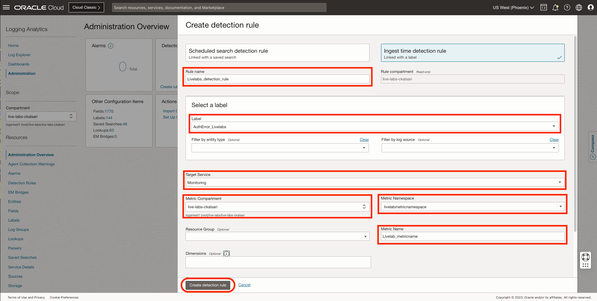

# Create and Trigger Ingest Time Detection Rule

## Introduction

In this lab, you will understand the concept of Ingest Time Detection rule in Logging Analytics.

Estimated Time: 10 minutes.

### Objectives

In this lab you will:

* Understand the meaning of Ingest Time Detection rule.
* Create a Ingest Time Detection rule.
* Trigger a Ingest Time Detection rule.

### Prerequisites

This lab assumes you have:

* An Oracle Cloud Infrastructure account.

## Task 1:  Understanding Ingest Time Detection Rules

Detection in Logging Analytics means detecting specific content in the log records. Detection rules are the rules by which we can detect specific content in the log records. Detection rules help you to detect events of your interest and post metrics in OCI Monitoring service. You can do this by creating a detection rule based on the label which is associated with the log record from specific log sources and entity types.

Let's say you want to detect whenever you have an authentication error in your log content, you can do it by creating a detection rule.

**Ingest time detection rule:** is applied at time of log ingestion, and sends the result of rule to Monitoring service. There are many ways to ingest logs like, on demand upload, using service collectors, using historic object collection, etc.

## Task 2: Check the Policies

To create and manage Detection Rules and use them in the Monitoring Service, the correct policies need to be set:
  ```
    <copy>Policies allow group &lt;group name&gt; to manage loganalytics-ingesttime-rule in tenancy
    allow service loganalytics to use metrics in tenancy</copy>
  ```

Replace the group name with whatever group fills your needs, be sure that your user is part of that group.

To set the policies go to **"Identity & Security"** > **"Identity"** > **"Policies"**


Here you can create a new policy or edit an existing one to contain the needed policies.

## Task 4: Create Ingest Time Detection Rule

In this task you will learn how to create a Ingest time detection rule.

For creating a detection rule, you need a log source and entity associated with it. You also need a specific parser corresponding to the type of logs which will be collected and parsed. You also need a label which will be associated to specific content of log records, so that you can create a detection rule on that particular label.

1. From **Navigation Menu**  > **Observability & Management** > **Logging Analytics** > **Administration** > **Detection Rules box** > **Create Detection Rule**.


2. Create detection rule dialog box opens. Click on **Ingest time detection rule**.


3. Specify a **Rule name** for the ingest time detection rule.Let say, you named it as **Livelabs\_detection\_rule**. Verify the **Rule compartment** as it is read-only.

4. In the **Select a label** section, from the dropdown, select the Label which must be detected in the log records. You can select a predefined label or can create a custom label. Let's say you have selected a custom label named **AuthError_Livelabs** which has a specific condition on which it will get associated to logs if that condition matches with any log record. You can refer to [Lab 2: Create a Label](?create-label) to create custom labels.

5. (Optional) You can specify the **Entity Type** and **Log Source** to use for filtering the log records.

6. Specify the **Target Service** where the alert must be reported. Select **Monitoring service**. The metric generated in the Monitoring service with the information of the alerts generated.

7. Select the **Metric Compartment** where the metrics must be stored.

8. Select **Metric Namespace**, the metric namespace where you want to put the new metric. The scope of options available for selecting the namespace is defined by the selection of Metric Compartment in the previous step. If options are not available, then you can also enter a new value for the namespace. Let's say, you have named Metric Namespace as **"livelabmtericnamespace"**.

9. (Optional) You can specify the **Resource Group**, the group that the metric belongs to. A resource group is a custom string provided with a custom metric.

10. Specify a **Metric Name**, the name of the metric, used in the Monitoring service explorer to view the metrics. Let's say you named it as **"Livelab_metricname"**.

11. (Optional) By default, Label and Rule OCID are used as **Dimensions**. Additionally, if required, you can select more values from the available options of fields for Dimensions. These are the values that can be used to filter the metric data. The field options available to you for selection depend on the log source you specified in step 4 in addition to some commonly used fields. If no log source is specified, then all fields are available.


12. Click **Create detection rule**.

When the match specified in the log source is encountered in the log record while ingesting, a metric value is posted to OCI Monitoring service. You can get alerts from OCI Monitoring service by configuring an alarm on that metric, which is demonstrated in further lab. 

> **Note** : **It is required to trigger the Ingest Time Detection rule one time, to post the metric and register the Metric Namespace in the system.**

## Task 5: Create a Source

1. You will have to create a source by referring to [Lab 4: Create a Source](?lab=create-source).

2. Details for the source are mentioned below:
    * **Name:** Livelab_source
    * **Description:** Source to detect AuthError_Livelabs
    * **Source Type:** File
    * **Entity Types:** Select any entity types. For example, Host(Linux)
    * **Parser:** livelab\_mushop\_api\_logs (Created in [Lab 3: Create a Parser](?lab=create-parser))

3. You have made above detection rule to detect the **AuthError_Livelabs** label, so you will to add a condition. This condition will help to attach the log record with label after getting parsed by parser.

4. Click on **Labels**. Now, click on **Add conditional label**.


5. In the Conditions section:
    * Select the log field on which you want to apply the condition from the Input Field list. Select **Status** from dropdown list.
    * Select the operator from the Operator list. Select **Contains** or **Equals**. Both can be used in the given use case.
    * In the Condition Value field, specify the value of the condition to be matched for applying the label. For failed APIs, values of Status can be **401, 400, 404, 406, 408** which we extracted using parsers from log records.
    * Under Actions, select from the already available Oracle-defined or user created labels. If required, you can create a new label by clicking **Create Label**. You can refer to [Lab 2: Create a Label](?lab=create-label) to create a label. You will select **AuthError_Livelabs**, as you have made a detection rule to detect it.
    * Click on **Add**.


6. Click on **Create Source**.


## Task 6: Upload a File

1. Upload some log records from desktop to the console, so that it will get parsed, label will get attached to it as per the condition and it will get detected in the detection rule. You can refer to [Lab 5: Upload a File](?lab=upload-file) to upload a file.

2. You will use log records on which the **livelab\_mushop\_api\_logs** parser is created.

3. Copy the below python script, and save it in a file.
    ```
    <copy>
    import random
    from datetime import datetime, timedelta

    current_time = datetime.utcnow()
    method = ["POST", "GET"]
    username = ["livelabuser01", "Naman", "Jacob", "Riya", "livelabuser02"]
    client_ip = ["::ffff:10.244.0.104", "::ffff:10.244.0.257", "::ffff:10.244.0.158", "::ffff:10.244.0.007", "::ffff:10.244.0.257"]
    req_code = ["401", "200", "201", "304", "400", "404", "406", "409", "500", "503"]
    content_length = random.randint(10,1000)

    for i in range(1000): # 1000 random logs generated
        random_var_user_and_ip = random.randint(0,len(username)-1)
        # Generate a random number of seconds between 0 and 7200 (120 minutes)
        random_seconds = random.randint(0, 120*60)
        # Calculate the end time by subtracting random seconds from current time
        end_time_in_seconds = current_time - timedelta(seconds=random_seconds)
        # Random 1000 log records of 2 hours before current UTC time.
        end_time_in_proper_format = end_time_in_seconds.strftime('%d/%b/%Y:%T')
        log = client_ip[random_var_user_and_ip] + " - " + username[random_var_user_and_ip] + " [" + end_time_in_proper_format + " +0000] " + '"' + method[random.randint(0,len(method)-1)] + " /api/orders HTTP/1.1" + '" ' + req_code[random.randint(0,len(req_code)-1)] + " " + str(content_length) + ' "-" ' + '"python-requests/2.25.1"' + "\n"
        with open('livelab_logs.txt', 'a') as f:
            f.write(log)
        f.close()
    </copy>
    ```

4. Run the python file in any desired IDE or terminal. A file named **livelab\_logs.txt** will be created at the location where python script is executed. This file will contains 1000 random log records, generated in interval of your current UTC time and 2 hours before your current UTC time.

5. Upload the file into console, by referring to [Lab 5: Upload a File](?lab=upload-file).

6. Select **Livelab_source** which was created in **Task: 5**. Click on **Upload**.


## Task 7: Trigger a Ingest Time Detection rule

1. From **Navigation Menu**  > **Observability & Management** > **Logging Analytics** > **Administration**.

2. Click on **Detection Rule box** on **Administration Overview** page.


3. Click on **Livelab\_detection\_rule**.

4. In the **Results** section, a graph will be shown. You can change the timeframe from **Quick Selects**, to Last 6 hours. You can also select a different **Statistic**.


5. Hence, your labels are detected in ingest time detection rule.

You may now proceed to the **proceed to the next lab**.

## Learn More

For further reading please refer to the resources.

[Allow Users to Perform Ingest Time Alert Rule Operations] (<https://docs.oracle.com/en-us/iaas/logging-analytics/doc/detect-predefined-events-ingest-time.html#GUID-4D1BB2CD-D69F-4966-BAEB-B291677D7F1E:~:text=Detected%20Events.-,Allow%20Users%20to%20Perform%20Ingest%20Time%20Alert%20Rule%20Operations,-%F0%9F%94%97>)

## Acknowledgements

* **Author** - Chintan Kalsaria, OCI Logging Analytics
* **Contributors** -  Chintan Kalsaria, Kiran Palukuri, Ashish Gor, Kumar Varun, OCI Logging Analytics
* **Last Updated By/Date** - Chintan Kalsaria, Dec, 2023
