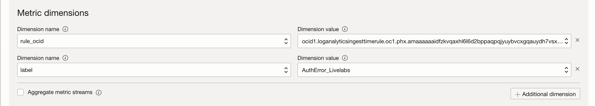

# Create and Verify an Alarm

## Introduction

In this lab, you will understand the concept of Alarms in Logging Analytics.

Estimated Time: 10 minutes.

### Objectives

In this lab you will:

* Understand the meaning of Logging Analytics Alarm.
* Create an Alarm.
* Verify an Alarm.

### Prerequisites

This lab assumes you have:

* An Oracle Cloud Infrastructure account.

## Task 1: Understand a Logging Analytics Alarm

You can set up alarms for the events detected at ingest time or by the scheduled searches by specifying the threshold, time range, and the notification. When the search criteria meets the threshold value over the specified time interval, an alert is generated and a notification is sent to the specified recipient.

To set up an alarm, you must first create a detection rule to detect an event. The following events can be detected: scheduled task for the saved search which can emit metrics to the Monitoring service. Managing alarms is part of the Monitoring service.

The detected events can emit metrics to the Monitoring service. Managing alarms is part of the Monitoring service. Ensure that the required IAM policies are created when you create a detection rule, which will be sufficient to use the alarm feature in the Monitoring service.

## Task 2: Create an Alarm

1. There are 2 two ways to navigate to **Create Alarm Page**:

    ### **Option 1:**

    From **Navigation Menu**  > **Observability & Management** > **Monitoring** > **Alarm Status**.

    * Here, all the alarms fired by the events in Logging Analytics are consolidated. The table displays the alarm name, its severity, the time when it was triggered, and whether it is suppressed or not.
    * Select the **Compartment** of your alarms in the **Scope section**.
    * Click on the **Create Alarm**. The Create Alarm dialog box opens.
    

    ### **Option 2:**

    * After creating a Detection rule, you will land up on detection rules page, where you will able to see all the detection rules. Click on the desired detection rule. You can refer to [Lab 6: Create and Trigger a Ingest Time Detection Rule](?lab=create-and-trigger-ingest-time-detection-rule) or [Lab 7: Create a Scheduled Search Detection Rule](?lab=create-scheduled-search-detection-rule). For example, select **Livelab\_detection\_rule**, made in [Lab 6: Create and Trigger a Ingest Time Detection Rule](?lab=create-and-trigger-ingest-time-detection-rule).
    

2. Click on **Create Alarm** button as seen in figure. The Create Alarm dialog box opens.

3. Specify the **Alarm name**. For example, **"Livelab_alarm"**.

4. For **Alarm severity**, select the perceived type of response required when the alarm is in the firing state. There are 4 options for it
    * Critical (by default)
    * Error
    * Warning
    * Info

5. (Optional) For **Alarm body**, enter the human-readable content of the notification.
It is recommended to provide guidance to operators for resolving the alarm condition. Consider adding links to standard runbook practices. Example: "High CPU usage alert. Follow runbook instructions for resolution."

6. (Optional) In the **Tags (optional)** area, enter one or more tags for the alarm.
If you have permissions to create a resource, then you also have permissions to apply free-form tags to that resource. To apply a defined tag, you must have permissions to use the tag namespace. For more information about tagging, see Resource Tags. If you're not sure whether to apply tags, skip this option or ask an administrator. You can apply tags later.

7. In the **Metric description** area, enter values to specify the metric to evaluate for the alarm.

    1. **Compartment:** Select the compartment  that contains the resources that emit the metrics evaluated by the alarm. The selected compartment is also the storage location of the alarm. By default, the first accessible compartment is selected.
    2. **Metric namespace:** Select the service or application that emits the metrics for the resources that you want to monitor. The Metric namespace list shows metric namespaces for the selected compartment. Let's say you selected **"livelabmetricnamespace"**, which you created while creating a detection rule.
    3. (Optional) **Resource group:** Select the group that the metric belongs to. A resource group is a custom string provided with a custom metric, and is not applicable to service metrics.
    4. **Metric name:** Select the name of the metric that you want to evaluate for the alarm. Let;s say you selected **"Livelab_metricname"**, which you created while creating detection rule.
    5. **Interval:** Select the aggregation window, or the frequency at which data points are aggregated. You can create a custom interval if needed. For example, 15 minutes.
    6. **Statistic**: Select the function to use to aggregate the data points.
        * Mean - The value of Sum divided by Count during the specified time period.
        * Rate - The per-interval average rate of change.
        * Sum - All values added together.
        * Max - The highest value observed during the specified time period.
        * Min - The lowest value observed during the specified time period.
        * Count - The number of observations received in the specified time period.
        * P50 - The value of the 50th percentile.
        * P90 - The value of the 90th percentile.
        * P95 - The value of the 95th percentile.
        * P99 - The value of the 99th percentile.
For example, select **count** statistic, which will tell count of Livelab_label in logs.

8. In the **Metric dimensions** area, specify optional filters to narrow the metric data that's evaluated.
    * **Dimension value:** Select the value to use for the specified dimension.
    * **Additional dimension:** Add another name-value pair for a dimension, as needed.
    * **Aggregate metric streams:** Select this check box to return the combined value of all metric streams for the selected statistic.
Let's say we give dimension name as **"label"**, which is having Dimension value as **"AuthError_Livelabs"**.

9. In the **Trigger rule** area, specify the condition that must be satisfied for the alarm to be in the firing state.
    * **Operator:** Select the operator to use in the condition threshold.
    * **Value:** Enter the value to use for the condition threshold. For the between and outside operators, enter both values for the range.
    * **Trigger delay minutes:** Enter the number of minutes that the condition must be maintained before the alarm is in the firing state.
    Let's say, you have selected operator as **"greater than or equal"**, value as **"30"**, and trigger delay minutes as **"1"**. So, the alarm will be triggered when the count of "AuthError_Livelabs" is greater than or equal to 30 with delay of 1 minute.

10. In the **Destination area** under **Define alarm notifications**, select the provider of the destination to use for alarm notifications.
    1. **Destination service:** Select one of the following values:
        * **Notifications:** Send alarm notifications to a topic. Each subscription in the topic receives an alarm message.
        * **Streaming:** Send alarm messages to a stream.
        Let's say you want to send Notifications.
    2. **Compartment:** Select the compartment that contains the resources that emit the metrics evaluated by the alarm. The selected compartment is also the storage location of the alarm. By default, the first accessible compartment is selected.
        * Stream (for Streaming only): The stream to use for alarm notifications.
        * Topic (for Notifications only): The topic to use for notifications. If there are no topics, you can create it. For example, **Topic_Livelab**.
    3. To create a new topic (and a new subscription) in the selected compartment, click **Create a topic** and then enter the following values:
        * **Topic name:** A user-friendly name for the topic. For example, enter: "Operations Team" for a topic used to notify operations staff of firing alarms. Avoid entering confidential information.
        * **Topic description:** Description of the new topic.
        * **Subscription protocol:** Medium of communication to use for the new topic. Select the type of subscription that you want to create, then enter values in the associated fields. For details about each subscription type, click the links.
            1. Email: Enter an email address.
            2. Function: Select the compartment and application that contain the function that you want, and then select the function.
            3. HTTPS (Custom URL): Enter the URL that you want to use as the endpoint.
            4. PagerDuty: Enter the integration key portion of the URL for the PagerDuty subscription.
            5. Slack: Enter the Slack endpoint, including the webhook token.
            6. SMS: Select the country for the phone number, and then enter the phone number.

11. For **Message grouping**, select one of the following options.
    * **Group notifications across metric streams:** Collectively track metric status across all metric streams. Send a message when metric status across all metric streams changes.
    * **Split notifications per metric stream:** Individually track metric status by metric stream. Send a message when metric status for each metric stream changes.

12. For **Message Format**, select an option for the appearance of messages that you receive from this alarm (for Notifications only).
    * **Send formatted messages:** Simplified, user-friendly layout. To view supported subscription protocols and message types for formatted messages (options other than Raw), see Friendly formatting.
    * **Send Pretty JSON messages (raw text with line breaks):** JSON with new lines and indents.
    * **Send raw messages:** Raw JSON blob.

13. (Optional) If you want to receive notifications at regular intervals when the alarm is firing, select **Repeat notification?** and then select **Notification frequency** to wait before resending the notification.
(Optional) To suppress evaluations and notifications for a specified length of time, select **Suppress notifications**. This option is useful for avoiding alarm notifications during system maintenance periods. Specify a start time, end time, and an optional description.

14. (Optional) To save the alarm without starting to evaluate metric data, clear the **Enable this alarm?** check box.

15. Click **Save alarm**.

The **Alarm Definitions** page lists the new alarm. If the alarm is enabled, then Monitoring begins evaluating the configured metric, sending alarm messages when the metric data satisfies the trigger rule.

## Task 3: Verify an Alarm

To verify the alarm, you need to upload log records, which will be parsed by parser, attaching label to the log record which satisfies the condition. Detection rule will detect the label and post the data into metric. Alarm will be triggered when the metric data satisfies the trigger rule.

1. Refer to [Lab 6: Task 6](?lab=create-and-trigger-ingest-time-detection-rule#Task6:UploadaFile) to upload a file in the console. Make sure to run the python script again, instead of using any old log records.

2. From **Navigation Menu**  > **Observability & Management** > **Monitoring** > **Alarm Definitions**.

3. Click on **Livelab\_alarm**.

4. All the information regarding the alarm will be shown there. You can change **Quick select** based on the requirement. Graph will be shown, showing the details. You can hover on graph know in details. Click on **Show Data Table** to see the timestamp and value clearly.

5. Details of logs can be seen from last two hour. Your threshold value was 30. Value of **AuthError_Livelabs** label can be seen in every 15 minutes from 12:15:00 UTC to 14:00:00 UTC. Initially alarm was in **Ok** state, then at 13:57:00 UTC, the alarm when into firing state. After one minute of delay, it was got reset and changed to **Ok** state, it means it is ready to get triggered. 

    The alarm gets triggered only one time despite, the value crossing above 30 two times. It happened because you uploaded 1000 logs at a single time. It will work perfectly if any live source is connected for log collection.

6. Hence, alarm is verified.

You may now proceed to the **proceed to the next lab**.

## Learn More

For further reading please refer to the resources.

[Updating an Alarm] (<https://docs.oracle.com/en-us/iaas/Content/Monitoring/Tasks/update-alarm.htm#top>)

[Viewing an Alarm Metric Chart] (<https://docs.oracle.com/en-us/iaas/Content/Monitoring/Tasks/create-edit-alarm-chart.htm#top>)

[Example Alarm Messages] (<https://docs.oracle.com/en-us/iaas/Content/Monitoring/alarm-message-examples.htm>)

[Best Practices for Your Alarms] (<https://docs.oracle.com/en-us/iaas/Content/Monitoring/Concepts/alarmsbestpractices.htm>)

[Suppressing an Alarm] (<https://docs.oracle.com/en-us/iaas/Content/Monitoring/Tasks/add-alarm-suppression.htm>)

## Acknowledgements

* **Author** - Chintan Kalsaria, OCI Logging Analytics
* **Contributors** -  Chintan Kalsaria, Kiran Palukuri, Ashish Gor, Kumar Varun, OCI Logging Analytics
* **Last Updated By/Date** - Chintan Kalsaria, Nov, 2023
