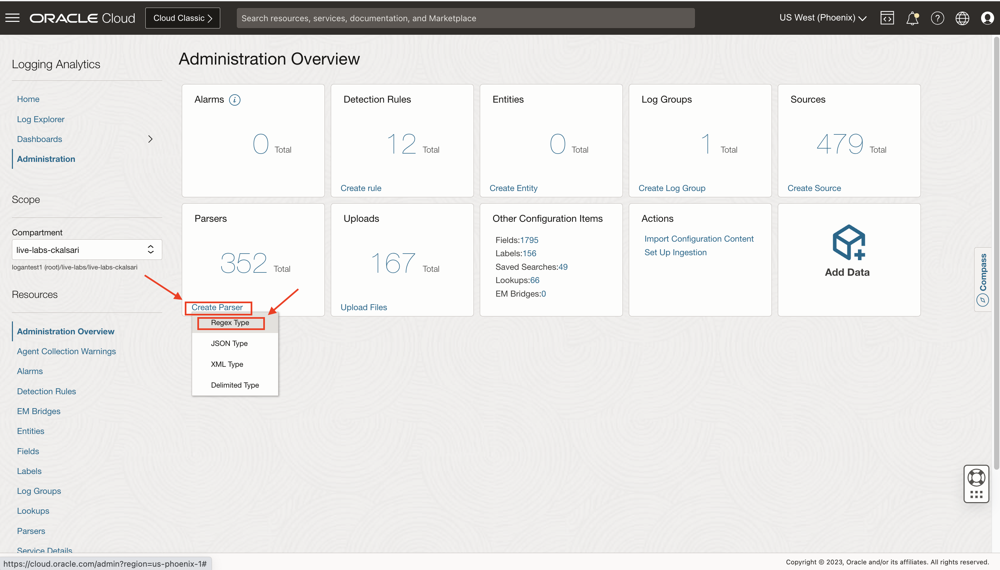
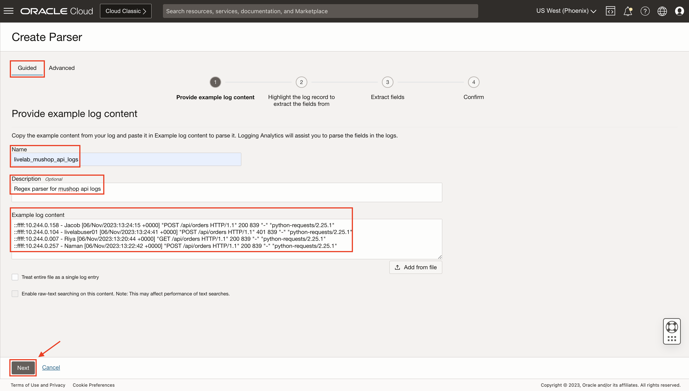
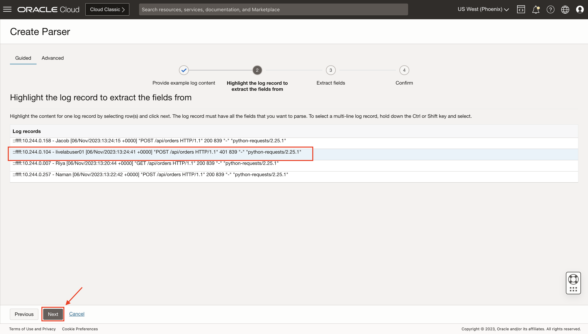
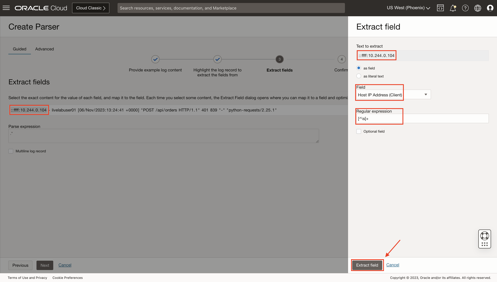
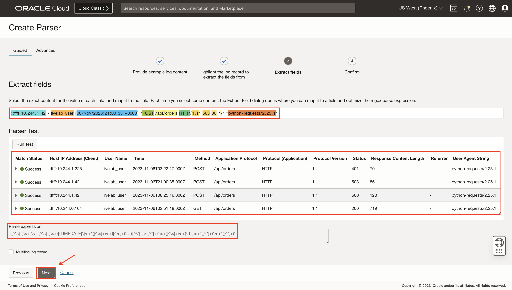
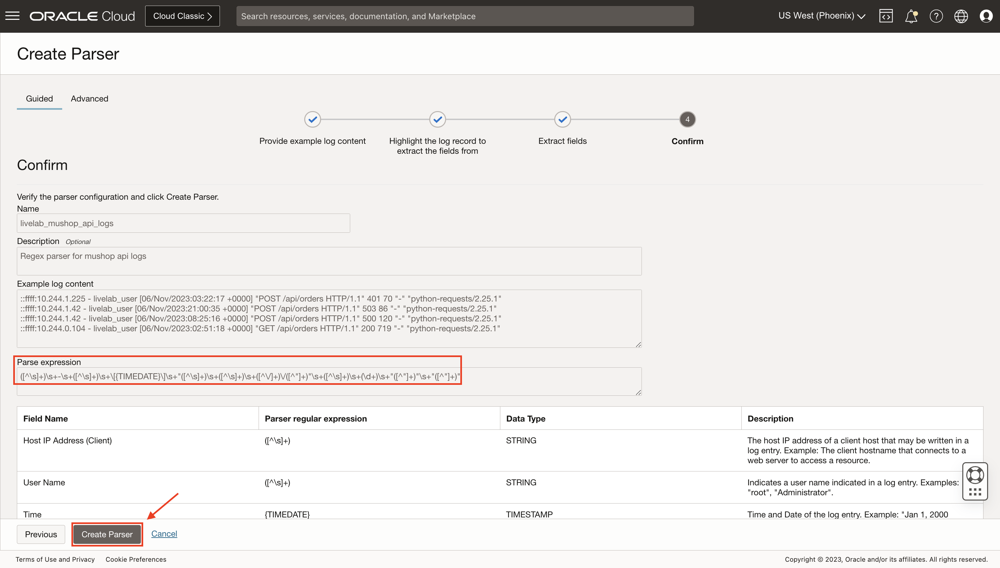

# Create a Parser

## Introduction

In this lab, you will understand the concept of Parser in Logging Analytics.

Estimated Time: 10 minutes.

### Objectives

In this lab you will:

* Understand the meaning of Parser in Logging Analytics.
* Create a single-line Parser.

### Prerequisites

This lab assumes you have:

* An Oracle Cloud Infrastructure account.

## Task 1: Understand a Logging Analytics Parser

A Parser takes raw configuration data and parses it into a nested attribute structure. Each parser consists of a base parser and parser parameters. Some parsers also contain post-parsing rules. A base parser essentially is a category of parser capable of parsing data of a particular format. Parser parameters provide a way to tailor the base format to accommodate variations in data formatting.

Oracle Logging Analytics offers hundreds of Oracle-defined sources and parsers that you can directly use without creating custom ones. To collect logs of a format which doesn't have an Oracle-defined source or parser, you can create custom source or parser.

There are four varieties of base parser:

1. Regex
2. JSON
3. XML
4. Delimited

Regex parser can be of 2 types:

1. Single-line
2. Multi-line

## Task 2: Create a single-line Parser

1. From **Navigation Menu**  > **Observability & Management** > **Logging Analytics** > **Administration**.


2. From the **Administration Overview Page**, click on the **Create Parser** button. A dropdown will appear, showing four types of parsers available. You can select parser type as per the sample log. In this lab, you will create a REGEX type parser. Click on **Regex Type**.


3. The **Create Parser Page** is displayed. In the case of REGEX type, the Create Parser page opens in the **Guided** mode. Continue in this mode if you want Logging Analytics to generate the regular expression to parse the logs after you select the fields. If you want to write regular expression for parsing, then switch to **Advanced** mode. You will go for **Guided** mode, as it is a straightforward method to create a parser, you will not need any knowledge of regular expression.

4. **First step** of parser creation:

    * In the **Name** field, enter the parser name. For example, enter **livelab\_mushop\_api\_logs**.
    * (Optional) Provide a suitable **description** to the parser for easy identification.
    * In the **Example Log Content field**, paste some logs from a log file that you want to parse, such as the following:

        ```text
        <copy>::ffff:10.244.1.225 - livelab_user [06/Nov/2023:03:22:17 +0000] "POST /api/orders HTTP/1.1" 401 70 "-" "python-requests/2.25.1"
        ::ffff:10.244.1.42 - livelab_user [06/Nov/2023:21:00:35 +0000] "POST /api/orders HTTP/1.1" 503 86 "-" "python-requests/2.25.1"
        ::ffff:10.244.1.42 - livelab_user [06/Nov/2023:08:25:16 +0000] "POST /api/orders HTTP/1.1" 500 120 "-" "python-requests/2.25.1"
        ::ffff:10.244.0.104 - livelab_user [06/Nov/2023:02:51:18 +0000] "GET /api/orders HTTP/1.1" 200 719 "-" "python-requests/2.25.1"</copy>
        ```

    * This is a single-line log entry, as each record is of a single line, as shown in the figure below.
    
    * Click on **Next** to go to the **second step** of parser creation.

5. Select one of the log records you want to extract the field from.

Click on **Next** to go to the **third step** of parser creation.

6. Select the exact content for the value of each field. For example, select the **"::ffff:10.244.0.14"** content from the shown log record, and a dialog of **Extract field** will appear. Here, you can see the text you want to extract as a field, and there is an option that if you do not want to extract it as a field, you can select **as literal text**. From the **Field** dropdown, select the existing **Field Name**, here it is **Host IP Address (Client)**. You can also create a custom field if it is not present in the dropdown. The **Regular expression** for the selected text will be auto-generated. Mark the **Optional field** button if you want to make the field optional. Click on the **Extract field** option to map the selected text to the field.


7. Selected text has been mapped to the field. You can see the **Parser Test**, where **Host IP Address (Client)** has been extracted from all the log records pasted in **Step 4**. **Parser expression** will also be auto-generated. **Match Status** will show if you successfully extracted the field from all the log records. Click on **Next** to select another content to log record to be extracted.


8. Repeat **Step 7** by selecting other content of the log i.e., **"livelabuser01"**. After clicking **Next**, another column of **User Name** field has been added to the table showing extracted user names from the log records. You will also see the **Parse expression** has been modified now.


9. Similarly, repeat **Step 7** until you extract all the fields from the selected log record. You will see all the extracted fields in the table, with their extracted value from the log records. Verify it by observing all the extracted fields to see if they seem fine. Click on **Next**.


10. This is the **fourth and last step** of parser creation. Verify the **Parse expression**, field name, parser regular expression, data type, description of each field. You can go to the **Previous** step if you want to change something.

11. Click on **Create Parser**.


You may now **proceed to the next lab**.

## Learn More

For further reading please refer to the resources:

* [How to use a RegEx Parser Builder?] (<https://www.youtube.com/watch?v=EoBJkaq9Png>)

* [Create JSON Type Parser] (<https://docs.oracle.com/en-us/iaas/logging-analytics/doc/create-parser.html#GUID-991679C0-9556-4F4D-A2E4-548A6D2C62CF:~:text=Logging%20Analytics.-,Create%20JSON%20Type%20Parser,-%F0%9F%94%97>)

* [Create XML Type Parser] (<https://docs.oracle.com/en-us/iaas/logging-analytics/doc/create-parser.html#GUID-25663BB6-2EDA-40ED-A982-060EEAA364F6:~:text=select%20Regex.-,Create%20XML%20Type%20Parser,-%F0%9F%94%97>)

* [Create Delimited Type Parser] (<https://docs.oracle.com/en-us/iaas/logging-analytics/doc/create-parser.html#GUID-1A53F099-5859-4DB5-9E1B-EA44C9941CF2:~:text=select%20Regex.-,Create%20Delimited%20Type%20Parser,-%F0%9F%94%97>)

## Acknowledgements

* **Author** - Chintan Kalsaria, OCI Logging Analytics
* **Contributors** -  Chintan Kalsaria, Kiran Palukuri, Ashish Gor, Kumar Varun, OCI Logging Analytics
* **Last Updated By/Date** - Chintan Kalsaria, Jan 2024