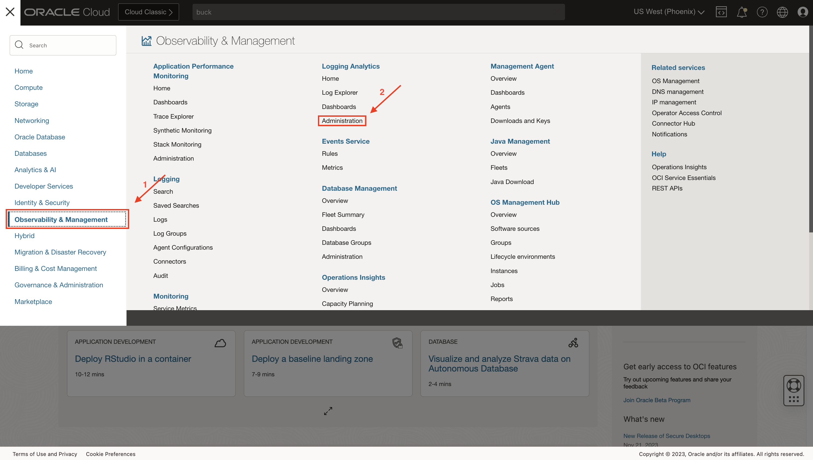
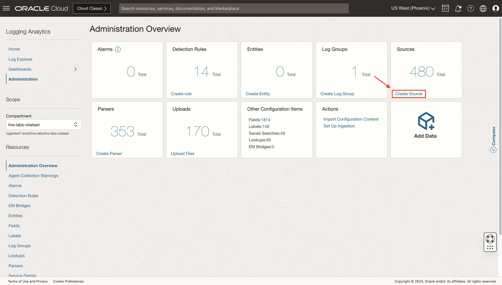
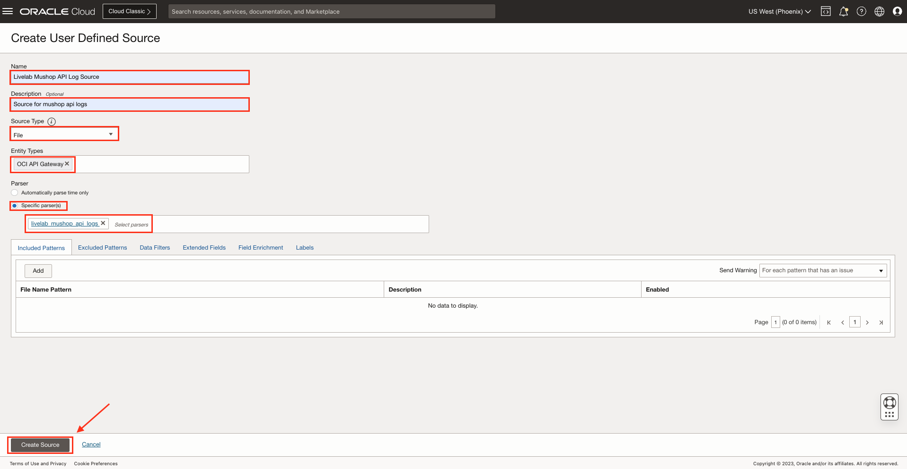

# Create a Source

## Introduction

In this lab, you will learn how to create a Source in Logging Analytics.

Estimated Time: 10 minutes.

### Objectives

In this lab you will:

* Understand the meaning of Logging Analytics Source.
* Create a Source.

### Prerequisites

This lab assumes you have:

* An Oracle Cloud Infrastructure account.

## Task 1: Understand a Logging Analytics Source

Log Sources define where the log files are located when you use management agent for collection, and how to parse and enrich the logs while ingesting them, irrespective of the method of ingestion. Oracle Logging Analytics has hundreds of sources for database, applications, and infrastructure of both Oracle origin and non-Oracle origin.

You can customize the Oracle-defined content by adding your own elements to them. When Oracle updates the Oracle-defined sources, you will continue to get those updates while at the same time keeping your customizations.

If you don't find an Oracle-defined source that suits your requirement, then you can create your own. When creating a source, you will need to pick one or more parsers to parse the log file into log entries and to break the log entry into fields. You can create a custom source and use an Oracle-defined parser if there is already one that matches your log format. If there is no Oracle-defined parser for your custom source, you can create a custom parser as well.

## Task 2: Create a Source

1. From **Navigation Menu**  > **Observability & Management** > **Logging Analytics** > **Administration** > **Sources box** > **Create Source**.

2. A **Create User Defined Source** page will appear. Fill the details.

3. **Name:** Enter the name of the source. For example, **Livelab API Mushop Log Source**.

4. (Optional)**Description:** Add a short description to describe the source.

5. **Source Type:**  Oracle Log Analytics supports six log source types:
    * **File:** Use this type for collecting most types of logs, such as Database, Application, and Infrastructure logs.
    * **Oracle Diagnostic Logging (ODL):** Use this type for logs that follow the Oracle Diagnostics Logs format. These are typically used for diagnostic logs for Oracle Fusion Middleware and Oracle Applications.
    * **Syslog Listener:** This is typically used for network devices such as Intrusion Detection Appliance, Firewall, or other device where a management agent could not be installed.
    * **Microsoft Windows:** Use this type for collecting Windows Event messages. Oracle Logging Analytics can collect all historic Windows Event Log entries. It supports Windows as well as custom event channels.
    * **Database:** Use this source type to collect the logs stored in the tables inside of an on-premises database. With this source type, a sql query is run periodically to collect the table data as log entries.
    * **REST API:** Use this source type to set up continuous REST API based log collection from endpoint URLs that respond with log messages. With this source type, a GET or POST API call is made to the endpoint URL that you provide to get the logs.

     Select any of the above source type. For example, **File**.

6. **Entity Type:** Click the Entity Type field and select the type of entity for this log source. Later, when you associate this source to an entity to enable log collection through the management agent, only entities of this type will be available for association. A source can have one or more entity types.
    * If you selected File, REST API, or Oracle Diagnostic Log (ODL), then it's recommended that you select the entity type for your log source that most closely matches what you are going to monitor. Avoid selecting composite entity types like Database Cluster and instead select the entity type Database Instance because the logs are generated at the instance level.
    * If you selected the source type Syslog Listener, then select one of the variants of Host.
    * If you selected the source type Database, then the entity type is limited to the eligible database types.
    * If you selected Windows Event System source type, then the default entity type Host (Windows) is automatically selected, and cannot be changed.

    When you are uploading the log file directly from the desktop as seen in [Lab 5: Upload a File](?lab=upload-file), entity types does not matter. For example, **OCI API Gateway**.

7. **Parser:**
    * You can select multiple file parsers for the log files. This is particularly helpful when a log file has entries with different syntax and can’t be parsed by a single parser.
    * The order in which you add the parsers is important. When Oracle Logging Analytics reads a log file, it tries the first parser and moves to the second parser if the first one does not work. This continues until a working parser is found. Select the most common parser first for this source.
    * For ODL source type, the only parser available is Oracle Diagnostic Logging Format.
    * For Syslog source type, typically one of the variant parsers such as Syslog Standard Format or Syslog RFC5424 Format is used. You can also select from the Oracle-defined syslog parsers for specific network devices.
    * The File Parser field isn’t available for Windows Event System and REST API source types. For the Windows Event System source type, Oracle Logging Analytics retrieves already parsed log data.
    * To parse only the time information from the log entries, you can select the automatic time parser

    You have made a parser in [Lab 3: Create a Parser](?lab=create-parser), select **Specific parser(s)** button and select the user defined parser which was created earlier i.e. **livelab\_mushop\_api\_logs**.

8. Enter the following information depending on the source type:
    * Syslog source type: Specify Listener Port.
    * Windows source type: Specify an event service channel name. The channel name must match with the name of the Windows event so that the agent can form the association to pick up logs.
    * Database source type: Specify SQL Statements and click Configure. Map the SQL table columns to the fields available in the menu. To create a new field for mapping, click the Add icon icon.
    * REST API source type: Click Add log endpoint to provide a single log endpoint URL or Add log list endpoint for multiple logs to provide a log list endpoint URL for multiple logs from which the logs can be collected periodically based on the time configuration in the UI.
    * File and ODL source types: Use the Include Patterns, Exclude Patterns, Data Filters, Field Enrichment, Labels tab.

10. Click on **Create Source**.
    

You may now proceed to the **proceed to the next lab**.

## Learn More

For further reading please refer to the resources.

[Oracle defined Sources] (<https://docs.oracle.com/en-us/iaas/logging-analytics/doc/oracle-defined-sources.html#GUID-7DB43543-E971-4797-8971-DC9700326CAA>)

[Use Labels in Source] (<https://docs.oracle.com/en-us/iaas/logging-analytics/doc/create-log-source.html#GUID-E53DEDE9-E50A-4129-A252-C34440104DA8:~:text=Labels%20for%20sources.-,Use%20Labels%20in%20Sources,-%F0%9F%94%97>)

[Use Extended Fields in Sources] (<https://docs.oracle.com/en-us/iaas/logging-analytics/doc/create-log-source.html#GUID-8811F443-3EC1-4465-9D44-6EA164CD112C:~:text=editing%20existing%20sources.-,Use%20Extended%20Fields%20in%20Sources,-%F0%9F%94%97>)

[Configure Field Enrichment Options] (<https://docs.oracle.com/en-us/iaas/logging-analytics/doc/create-log-source.html#GUID-7A645A48-D295-435A-9791-4E572A2F108C:~:text=to%20%7BStatus%3A%5Cw%2B%7D-,Configure%20Field%20Enrichment%20Options,-%F0%9F%94%97>)

[Use the Automatic Time Parser] (<https://docs.oracle.com/en-us/iaas/logging-analytics/doc/create-log-source.html#GUID-4CC65CCE-5FE7-4DEC-9DC0-8A448979B5C7:~:text=Enabled%20check%20box.-,Use%20the%20Automatic%20Time%20Parser,-%F0%9F%94%97>)

## Acknowledgements

* **Author** - Chintan Kalsaria, OCI Logging Analytics
* **Contributors** -  Chintan Kalsaria, Kiran Palukuri, Ashish Gor, Kumar Varun, OCI Logging Analytics
* **Last Updated By/Date** - Chintan Kalsaria, Dec, 2023
