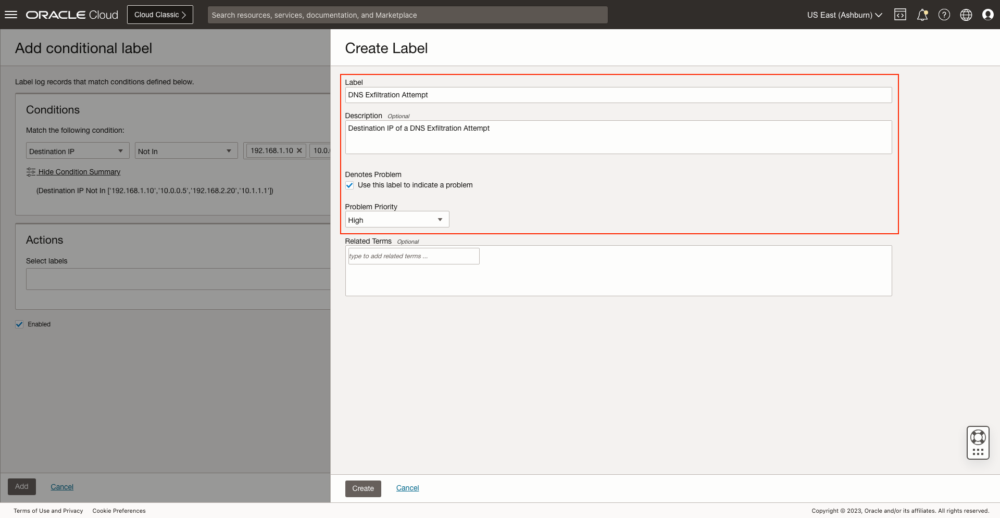

# DNS Exfiltration on Windows Systems

## Introduction

In this lab, you'll learn how to use problem labels and scheduled tasks together for creating more performant and sophisticated detection rules for alarms.

Log Name: Microsoft-Windows-DNS-Client/Operational
Event IDs: 3000 (Query), 3001 (Response)

Estimated Lab Time: 15 minutes

### Objectives

In this lab, you will:
* Label DNS query events in windows events
* Use query time lookup to verify DNS server by machines
* Create alarm per windows machine for DNS exfiltration

## **Task 1:**  Navigate to Parsers

1. Click on the **Administration** option inside the drop-down menu to access to **Administration Overview**.
 

2. Click on the option **Parsers** inside **Resources** sidebar menu at the left.
   

  Now you are in **Parsers**.
   

## **Task 2:**  Create Parser from Oracle-defined

1. Search for **Microsoft DNS**. In the **Oracle-defined** one, click on **Actions** button and then on **Duplicate**.
   

2. Specify a **Name** and **Description (optional)**.
   

3. Download sample logs file for [Log Sample](./files/microsoft-dns-logs.log) 
   Add the **microsoft-dns-logs.log** we downloaded to **Example log content**.
   

4. Specify the following regular expression at **Parser regular expression**: **{TIMEDATE}\s+(\S+)\s+(\S+)\s+(\S+)\s+(.+)**
   

   As we modified the **Parser regular expression** two more fields were added.
   

5. Select **Event** for the first field added.
   

6. Select **Destination IP** for the second field added.
   

7. Click on **Parser Test** and on **Run Test**.
   

   We verify that the fields are matching with the example logs we provided.
   

## **Task 2:**  Save Parser

1. Click on **Create Parser**.
   

2. The parser is saved successfully.
   

## **Task 3:**  Navigate to Sources

1. Click on the **Administration** option inside the drop-down menu to access to **Administration Overview**.
   

2. Click on the option **Sources** inside **Resources** sidebar menu at the left.
   

  Now you are in **Sources**.
   

## **Task 4:**  Create User Defined Source

1. Click on **Create Source**.
   

2. Specify the **Name** and **Description (optional)**. Select **File** as **Source Type** and **Microsoft DNS Server** at **Entity Types**.
   

3. Mark the **Specific parser(s)** option. Then, select **DNS Exfiltration on Windows Systems** which is the parser we created previously.
   

## **Task 5:**  Add Labels

1. Click on **Labels** and on **Add conditional field**.
   

2. Select **Destination IP** as **Input Field** and **Not In** as **Operator**. Add the following IPv4 addresses to **Condition Value**: 192.168.1.10, 10.0.0.5, 192.168.2.20, 10.1.1.1
   

3. Click on **Create New Field**.
   

4. Specify a **Name**, **Data Type** and **Description (optional)**. Click on **Create**.
   

   The field is added successfully.
   

5. Specify an **Output Value**.
   

6. Click on **Add**.
   

## **Task 5:**  Save User Defined Source

1. Click on **Create Source**.
   

   The source is saved successfully.
   

## **Task 6:**  Navigate to Uploads

1. Click on the option **Uploads** inside **Resources** sidebar menu at the left.
   

  Now you are in **Uploads**.
   

## **Task 7:**  Upload logs file

1. Click on **Upload Files**.
   

2. Specify an **Upload Name** and **Log Group Compartment**.
   

3. Click on **Create Log Group**.
   

4. Specify a **Name** and **Description (optional)**. Click on **Create**.
   

5. Download sample logs file for [Log Sample](./files/microsoft-dns-logs.log) 
   Click on **Select Files** and select the **microsoft-dns-logs.log** file.
   
   

6. Click on **Next**.
   

## **Task 8:**  Navigate to Log Explorer

1. Click on the **Log Explorer** option inside the drop-down menu.
   

2. Now you are in **Log Explorer**.
   

## **Task 9:**  Create a new Log Search

1. Type the following query in the text input: **'Entity Type' = 'Host (Windows)' and 'Log Source' = 'Windows System Events' | timestats count as logrecords by 'Log Source'**
   

2. Click on **Run** and see the results below.
   

## **Task 10:**  Save the Log Search

1. Specify the **Search Name** and the **Search Description (optional)**. Then, click on **Save** button.
   

  The log search is saved successfully.
   

## **Task 11:**  Navigate to Detection Rules

1. Click on the **Administration** option inside the drop-down menu to access to **Administration Overview**.
   

2. Click on the option **Detection Rules** inside **Resources** sidebar menu at the left.
   

  Now you are in **Detection Rules**.
   

## **Task 12:**  Create Scheduled search detection rule

1. In this lab you will use both **Scheduled search detection rule** and **Ingest time detection rule** for creating more performant and sophisticated detection rules for alarms.

  Click on **Create** inside **Detection Rules** page to start creating a new detection rule.
   

  First, we will create a **Scheduled search** type detection rule.
   

2. Specify a **Rule name** and **Saved search compartment**. Then, select the **Saved search** we created for the scheduled task.
   

3. Select **Monitoring** as **Target Service**. Specify a **Metric Compartment**, **Metric Namespace** and **Metric Name**. Finally, set the **Interval** to **1 Hours** and click on **Create detection rule**.
   

4. The detection rule is saved successfully.
   

## **Task 13:**  Navigate to Labels

1. Click on the option **Labels** inside **Resources** sidebar menu at the left.
   

2. Click on **Create** inside **Labels** page to start creating a new label.
   

## **Task 14:**  Create new Label

1. Specify the **Label** and **Description (optional)**.
   

2. Mark the **Use this label to indicate a problem** checkbox inside **Denotes Problem**. Then, select **High** for **Problem Priority**. Click on **Create**.
   

## **Task 15:**  Create Ingest time detection rule

1. Click on **Create** inside **Detection Rules** page.
   

2. Click on **Ingest time detection rule**.
   

3. Specify the **Rule name**. Select the **Label** we created and **Host (Windows)** for **Filter by entity type**.
   

4. Select **Monitoring** as **Target Service**. Specify a **Metric Compartment**, **Metric Namespace** and **Metric Name**. Finally, click on **Create detection rule**.
   

5. The detection rule is saved successfully.
   

## Acknowledgements
* **Author** - Oswaldo Osuna, Logging Analytics Development Team
* **Contributors** -  Kumar Varun, Logging Analytics Product Management - Kiran Palukuri, Logging Analytics Product Management - Vikram Reddy, Logging Analytics Development Team 
* **Last Updated By/Date** - Oswaldo Osuna, Oct 23 2023
