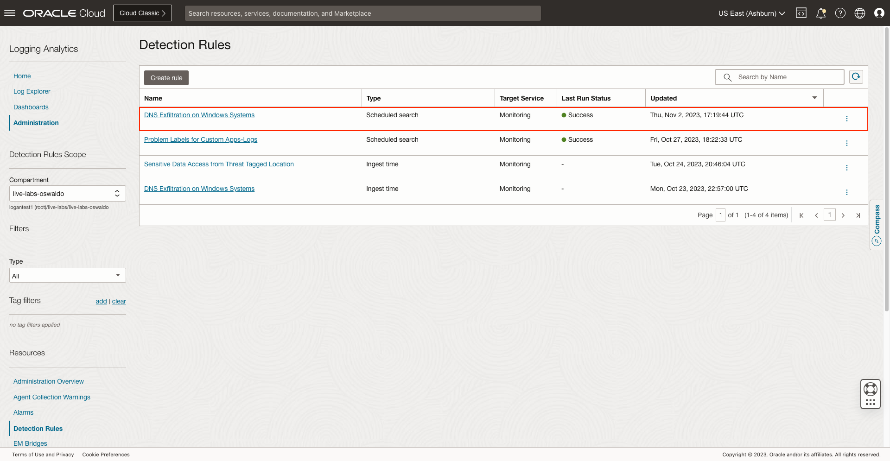

# How to create alert for DNS exfilteration events from Windows Systems?

Duration: 10 minutes

## Create Parser from Oracle-defined

1. Inside **Administration**, click on the option **Parsers** inside **Resources** sidebar menu at the left.
   

2. Search for **Microsoft DNS**. In the **Oracle-defined** one, click on **Actions** button and then on **Duplicate**.
   

3. Specify a **Name** and **Description (optional)**.

4. Download sample logs file for [Log Sample](./files/microsoft-dns-logs.log) 
   Then add the **microsoft-dns-logs.log** we downloaded to **Example log content**.
   

5. Specify the following regular expression at **Parser regular expression**: **{TIMEDATE}\s+(\S+)\s+(\S+)\s+(\S+)\s+(.+)**
   

   As we modified the **Parser regular expression** two more fields were added.

6. Select **Event** for the first field added.
   

7. Select **Destination IP** for the second field added.
   

8. To verify, click on **Parser Test** and on **Run Test**.

9. Click on **Create Parser**.

## Create User Defined Source

1. Inside **Administration**, click on the option **Sources** inside **Resources** sidebar menu at the left.
   

2. Click on **Create Source**.

3. Then specify the **Name** and **Description (optional)**. Select **File** as **Source Type** and **Microsoft DNS Server** at **Entity Types**.

4. Make sure the **Specific parser(s)** option is marked and select **DNS Exfiltration on Windows Systems** which is the parser we created previously.
   

## Add Labels

1. Click on **Labels** and on **Add conditional label**.

2. Select **Destination IP** as **Input Field** and **Not In** as **Operator**. Add the following IPv4 addresses to **Condition Value**: 192.168.1.10, 10.0.0.5, 192.168.2.20, 10.1.1.1
   

3. Then click on **Create Label**.

4. Specify a **Label** and **Description (optional)**. Check **Detonates Problem** and select **High** as **Problem Priority**.
   

5. Click on **Create**.

6. Click on **Create Source**.

## Upload logs file

1. Inside **Administration**, click on the option **Uploads** inside **Resources** sidebar menu at the left.

2. Click on **Upload Files**.

3. Specify an **Upload Name** and **Log Group Compartment**.

4. Click on **Create Log Group** or use and existing one.

5. If you decided to create a **Log Group** specify a **Name** and **Description (optional)** and click on **Create**.

6. Download sample logs file for [Log Sample](./files/microsoft-dns-logs.log)

7. Tweak the logs' date so it is less than 1 hour before current UTC time.
   

8. Click on **Select Files** and select the **microsoft-dns-logs.log** file.
   

9. Click on **Next**.

10. Click on **Set Properties**.

11. At **Source**, select **DNS Exfiltration on Windows Systems** which is the source we created previously and click on **Save Changes**.
   

12. Click on **Next**.

13. Click on **Upload**.

14. When the **Submission Status** is **Success**, click on **Close**.

## Create a new Log Search

1. Click on the **Log Explorer** option inside the drop-down menu.
   

2. Type the following query in the text input **'Log Source' = 'DNS Exfiltration on Windows Systems' | timestats count as logrecords by 'Log Source'**
   

3. Then click on **Run** and see the results below.

4. Open the **Actions** drop-down and click on **Save as...**.
   

5. Then specify the **Search Name** and the **Search Description (optional)**.

6. Click on **Save** button.

## Create Scheduled search detection rule

1. Click on the option **Detection Rules** inside **Resources** sidebar menu at the left.

2. Click on **Create** inside **Detection Rules** page to start creating a new detection rule.

3. Then click on **Scheduled search detection rule**.

4. Specify a **Rule name**.

5. Select a **Saved search compartment** and for **Saved search** select **DNS Exfiltration on Windows Systems** which is the log search we created previously.

6. Select **Monitoring** as **Target Service**. Specify a **Metric Compartment**, **Metric Namespace** and **Metric Name**.

7. Finally, set the **Interval** to **30 Minutes** and click on **Create detection rule**.

## See the results of Scheduled search detection rule

1. Click on **DNS Exfiltration on Windows Systems** scheduled search type detection rule.
   

2. At **Results**, we can see there has been a DNS Exfiltration Attempt (change the **Quick Selects** if needed).
   

3. Click on **View In Metric Explorer**.

4. We can see the same result in the **Metrics Explorer** view.
   

## Create Ingest time detection rule

1. Click on **Create** inside **Detection Rules** page.

2. Click on **Ingest time detection rule**.

3. Specify the **Rule name**, for the **Label**, select **DNS Exfiltration Attempt****Label** which is the one we created previously and **DNS Exfiltration on Windows Systems** for **Filter by log source**.
   

4. Then select **Monitoring** as **Target Service**, specify a **Metric Compartment**, **Metric Namespace** and **Metric Name**.

5. Finally click on **Create detection rule**.

## Create alarm for Detection Rules

1. Navigate to **Detection Rules**.

2. Click on **DNS Exfiltration on Windows Systems** Scheduled search type.
   

3. Click on **Create Alarm**.

4. Specify an **Alarm name** and **Alarm body (optional)**. Set **Critical** for **Alarm severity**.

5. Scroll down to **Destination** and click on **Create a topic**.
   

6. Specify a **Topic name** and **Topic description (optional)**. Select **Email** as **Subscription protocol** and specify a **Subscription Email**.

7. Then click on **Create topic and subscription**.

8. Finally click on **Save alarm**.

9. Do the same process of **Create Alarm** for the **DNS Exfiltration on Windows Systems** Ingest time type.

## Upload logs file and see the results of Ingest time Detection Rule

1. Navigate to Uploads.

2. Click on the **Upload** we created for this live lab.
   

3. Tweak the file **microsoft-dns-logs.log** so the date of each log is less than 1 hour before current UTC time.
   

4. Click on **Select Files** and open the logs file we modified.

5. Click on **Next**.

6. Click on **Set Properties**.

7. At **Source**, select **DNS Exfiltration on Windows Systems** which is the source we created previously then click on **Save Changes**.

8. Click on **Next**.

9. Click on **Upload**.

10. When the **Submission Status** is **Success** click on **Close**.

11. Navigate to Detection Rules and select the **DNS Exfiltration on Windows Systems** ingest time type detection rule.
   

12. At **Results** we can see there has been a **DNS Exfiltration Attempt**.
   

13. Click on **View In Metric Explorer**.

14. We can see the same result in the **Metrics Explorer** view.
   

## See the Alarms results

1. Navigate to **Alarms**.

2. At **Alarm Definitions** click on the alarms we created.
   

3. We can see both alarms are **Firing**.
   
   

## Acknowledgements
* **Author** - Oswaldo Osuna, Logging Analytics Development Team
* **Contributors** -  Kumar Varun, Logging Analytics Product Management - Kiran Palukuri, Logging Analytics Product Management - Vikram Reddy, Logging Analytics Development Team 
* **Last Updated By/Date** - Oswaldo Osuna, Dec 4 2023
