# Problem Labels for Custom Apps-Logs

## Introduction

In this lab, you'll learn how to use a SQL query to pull data from DB Table and ingest each row as a log-record
"SELECT name,total_mb*1024*1024 as total,free_mb*1024*1024 as free FROM v$asm_diskgroup_stat where exists (select 1 from v$datafile where name like '+%')".

Estimated Lab Time: 10 minutes

### Objectives

In this lab, you will:
* Understand how DB Table Log Collection works (Study)
* Learn how to create a DB SQL Log Source for an existing DB Entity
* Create alarm if available free space is 30% or less

## **Task 1:**  Navigate to Sources

1. Click on the **Administration** option inside the drop-down menu to access to **Administration Overview**.
   

2. Click on the option **Sources** inside **Resources** sidebar menu at the left.
   

  Now you are in **Sources**.
   

## **Task 2:**  Create User Defined Source

1. Click on **Create Source**.
   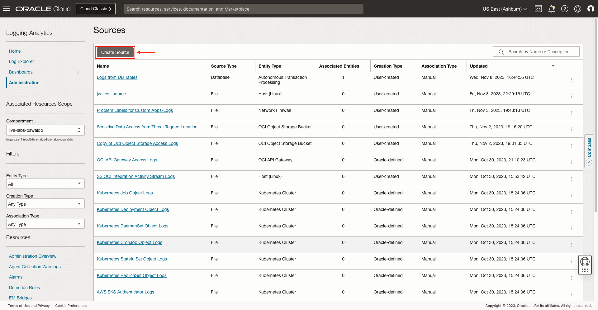

2. Specify the **Name** and **Description (optional)**. Select **Database** as **Source Type**. Set **Autonomous Transaction Processing** as **Entity Types**.
   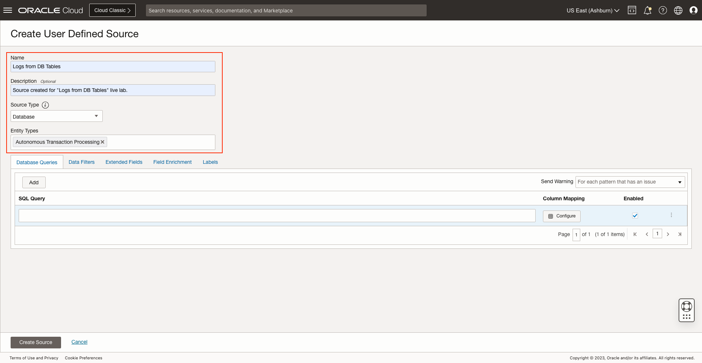

3. Click on **Database Queries** and add the following query: **SELECT name,total_mb*1024*1024 as total,free_mb*1024*1024 as free FROM v$asm_diskgroup_stat where exists (select 1 from v$datafile where name like '+%')**. Then, click on **Configure**.
   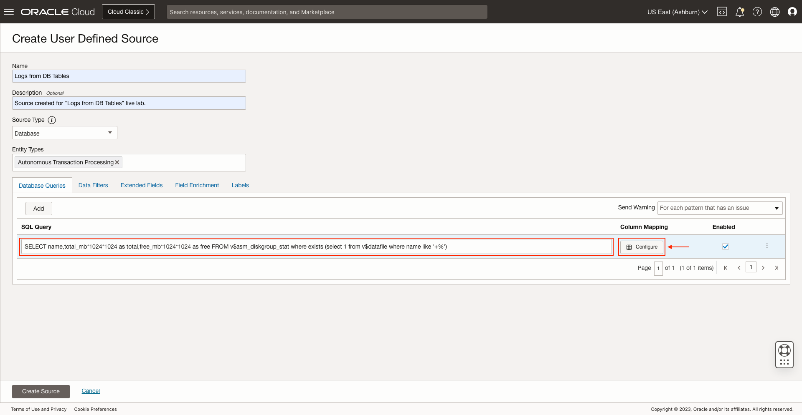

## **Task 3:**  Configure Column Mapping

1. Select **SQL query collection time** as **Sequence Column**.
   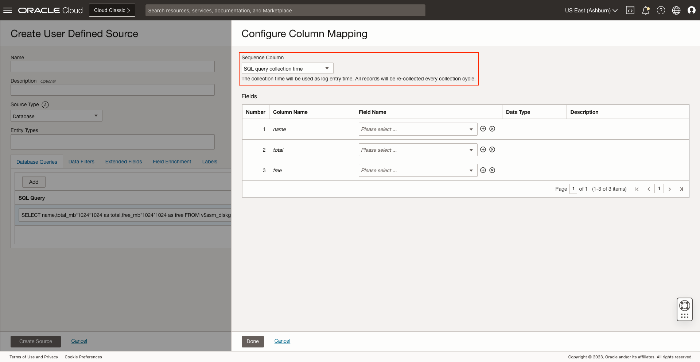

2. Select the following fields: **LiveLab11_Name** for **name** column, **LiveLab11_Total_MB** for **total** column and **LiveLab11_Free_MB** for **free**.
   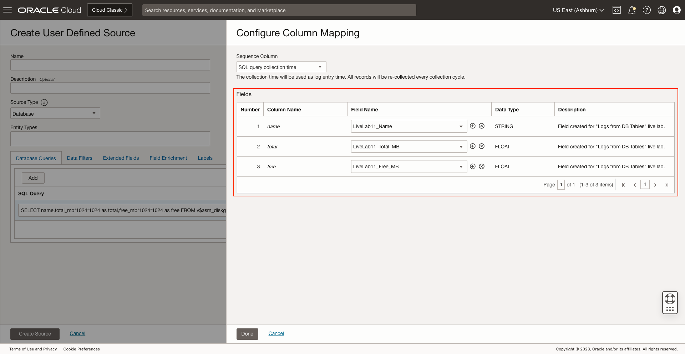

3. If the **Fields** do not exist, click on **Create New Field** and specify the **Name**, **Data Type** and **Description (optional)**, then click on **Create**.
   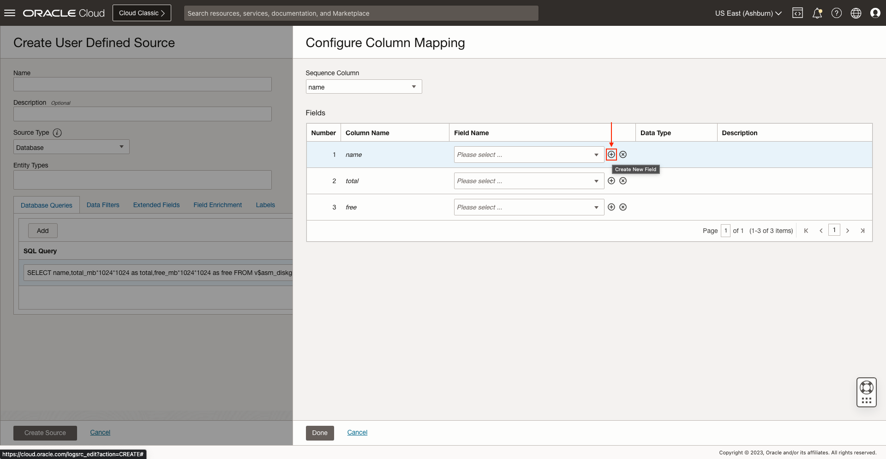
   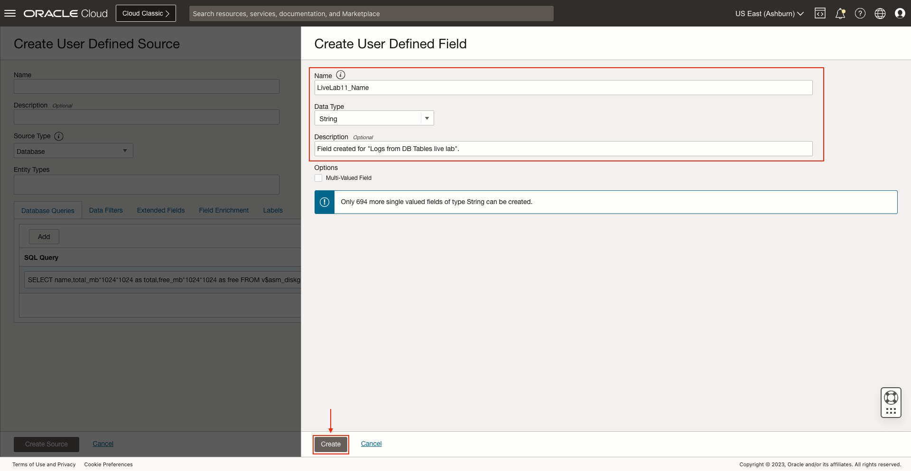

4. Click on **Done**.
   

## **Task 4:**  Save User Defined Source

1. Click on **Create Source**.
   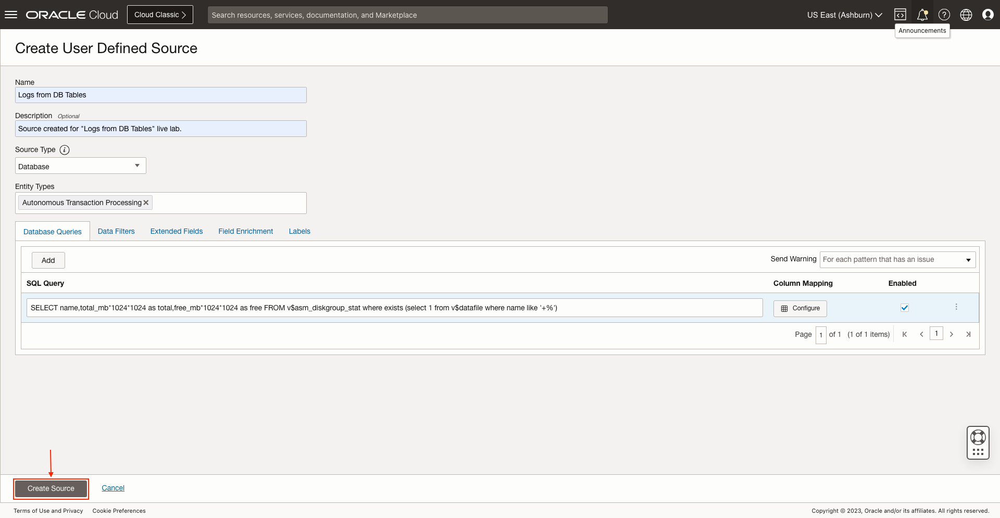

   The source is saved successfully.
   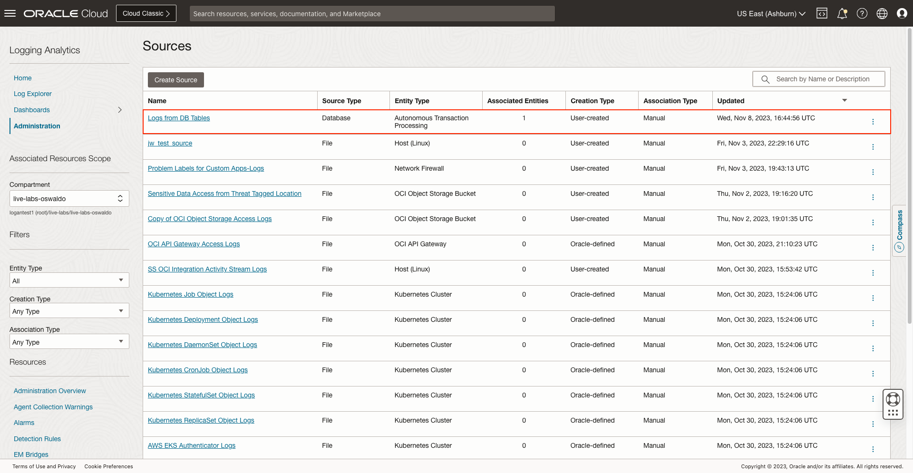

## **Task 5:**  Associate Entity to Source

1. Click on **Logs from DB Tables** which is the one we created.
   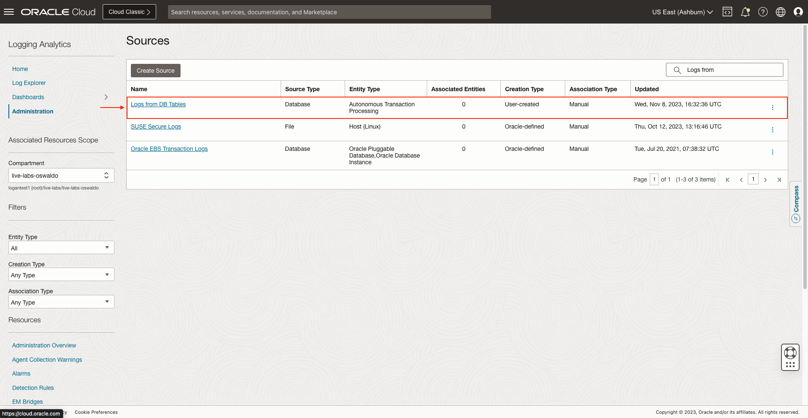

2. Click on **Unassociated Entities** at **Resources** menu.
   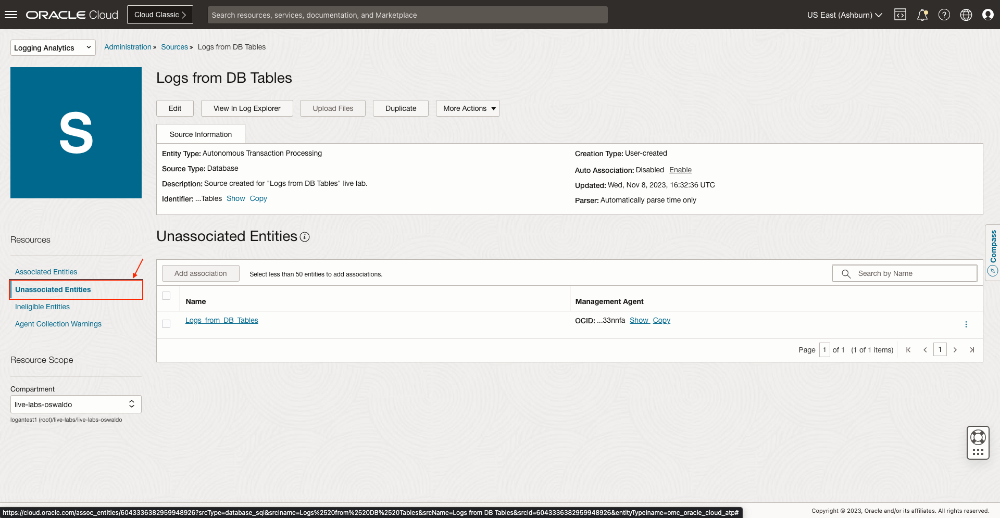

3. First, select **Logs_from_DB_Tables** which is the **Entity** for the **Autonomous Transaction Processing** Database. Then, click on **Add association**.
   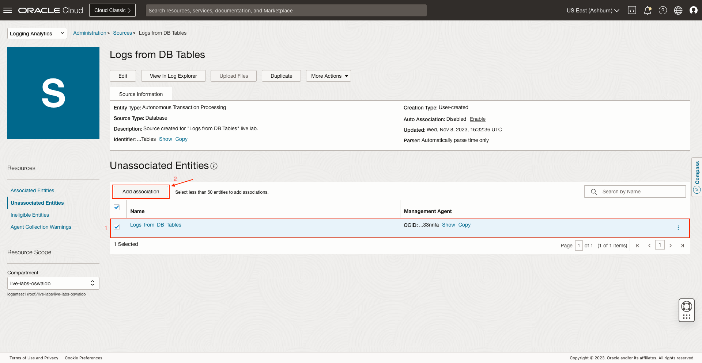

4. Click on **Submit**.
   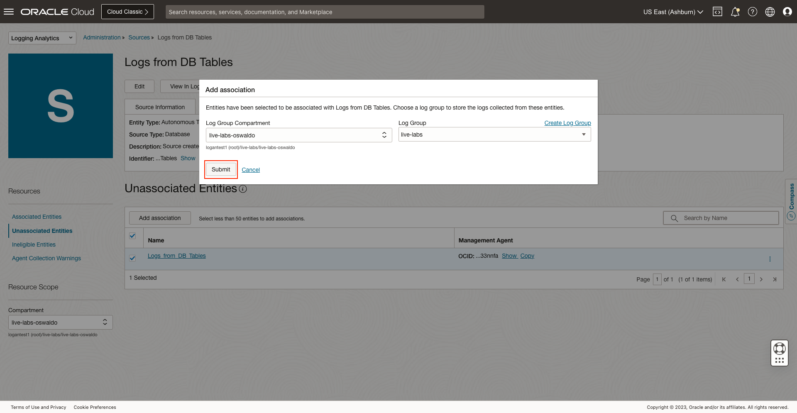

   The association is created successfully.
   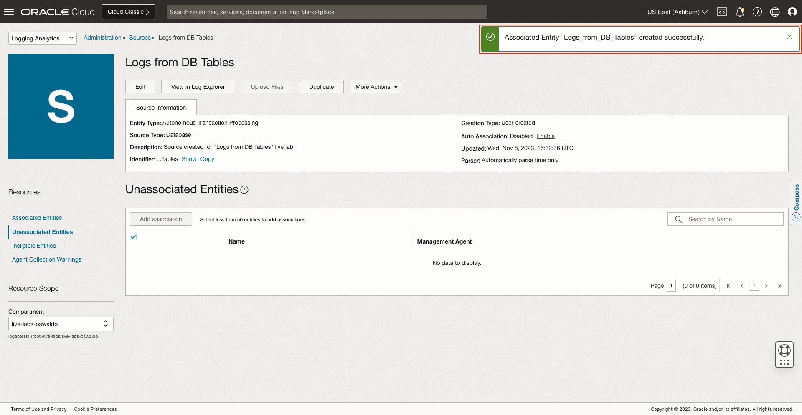

## **Task 6:**  Navigate to Detection Rules

1. Click on the **Administration** option inside the drop-down menu to access to **Administration Overview**.
   

2. Click on the option **Detection Rules** inside **Resources** sidebar menu at the left.
   

  Now you are in **Detection Rules**.
    

## **Task 7:**  Navigate to Alarm Definitions

1. Click on the navigation menu.
   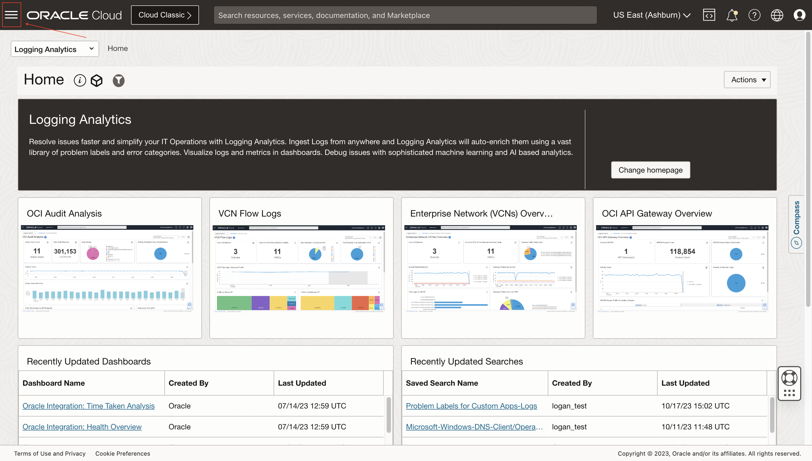

2. Click on **Observability and Management**. Then, click on **Alarm Definitions** inside **Monitoring**.
   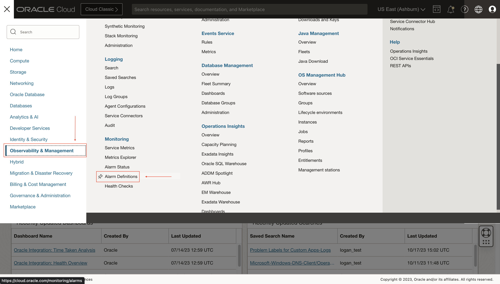

## **Task 8:**  Create Alarm

1. Click on **Create Alarm**.
   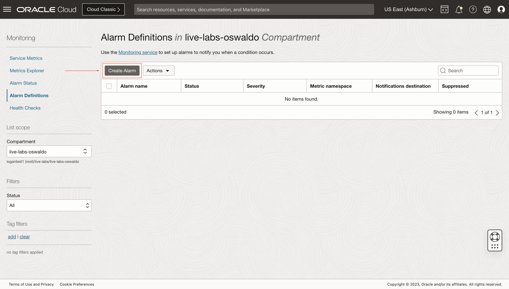

2. Specify an **Alarm name** and select **Warning** for **Alarm severity**. Specify an **Alarm body (optional)**.
   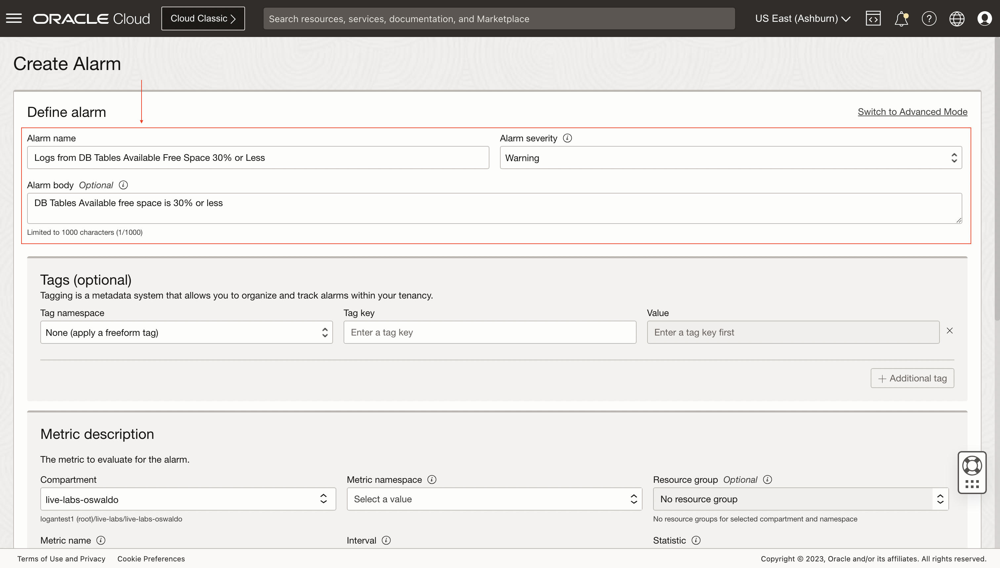

3. Select a **Compartment**. Then, select the **Metric namespace** and **Metric name** we created for the **Detection Rules**. Set the **Interval** for **30 minutes**. Finally, select **Count** for **Statistic**.

## Acknowledgements
* **Author** - Oswaldo Osuna, Logging Analytics Development Team
* **Contributors** -  Kumar Varun, Logging Analytics Product Management - Kiran Palukuri, Logging Analytics Product Management - Vikram Reddy, Logging Analytics Development Team 
* **Last Updated By/Date** - Oswaldo Osuna, Nov 8 2023
