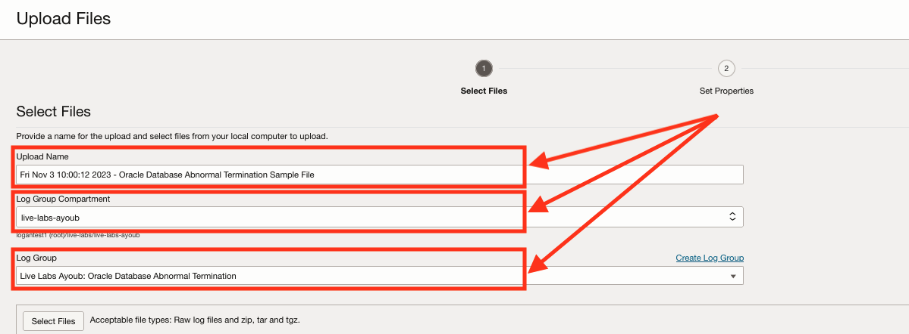
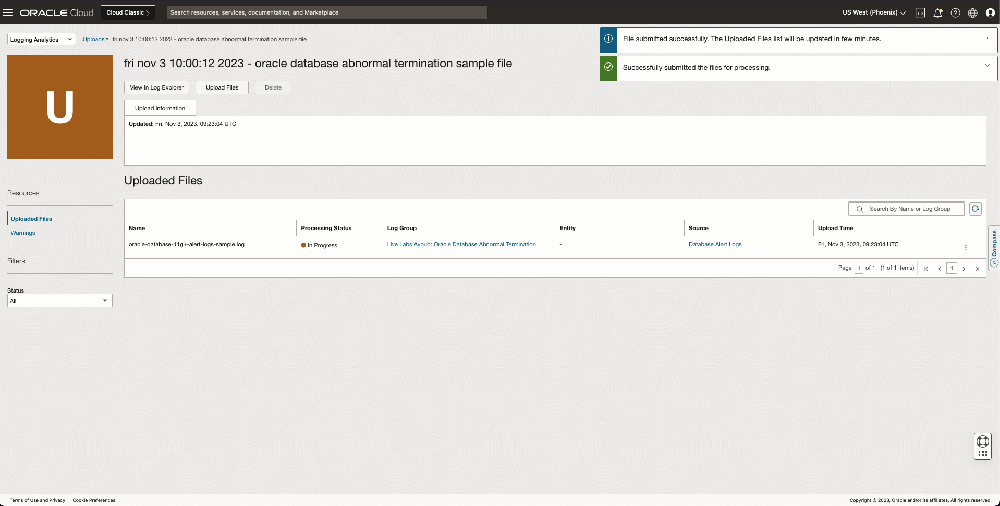

# Create an Oracle Database Abnormal Termination Detection Rule

## Introduction

In this lab will walk you through the steps to create Detection Rules & alarms for **Oracle Database Abnormal Termination** incidents.

This lab explains OOTB Labels (Out of the Box Oracle defined labels) with log sources and entities.

Estimated Time: 20 minutes

### Objectives

In this lab, you will:

* Create a Detection Rule with an Oracle predefined OOTB label.
* Create an alarm for the Detection Rule.

### Prerequisites

This lab assumes you have:

* An Oracle Cloud Infrastructure account.
* An Oracle Database 11g+ alert logs (Sample alert logs will be provided later in the live lab).

## Task 1: Check the Policies

To create and manage Detection Rules and use them in the Monitoring Service, the correct policies need to be set:

  ```Policies
    allow group &lt;group name&gt; to manage loganalytics-ingesttime-rule in tenancy
    allow service loganalytics to use metrics in tenancy
  ```

Replace the group name with whatever group fills your needs, be sure that your user is part of that group.

To set the policies go to **"Identity & Security"** > **"Identity"** > **"Policies"**


Here you can create a new policy or edit an existing one to contain the needed policies.

## Task 2: Create Detection Rules

1. Step 1

  Navigate to the Detection Rules Page (Follow the instructions on [2. Alarms and Detection Rules](?lab=alarms-detection-rules#Task3:CreateDetectionRules) for more information).
2. Step 2

  Click on **"Create rule"** button.

  
3. Step 3

  Select **"Ingest time detection rule"** then fill the static fields (Oracle Predefined values):
    - **Label:** Abnormal Termination
    - **Filter by log source:** Database Alert Logs

  
4. Step 4

  Fill the **"Rule name"** field, **Metric namespace** and **Metric name** (Preferably with meaningful, easy to remember names). Click on **"Create detection rule"** when done.

  

The Detection Rules creation pane will close and an info confirmation message should appear on screen if the rule was created, Otherwise you will need to correct the error(s) before the rule can be created.


## Task 3: Trigger the Detection Rule

The metrics created by Detection Rules are **UNAVAILABLE** in the monitoring service before they detect an event. A first file containing logs with the abnormal termination tag needs to be uploaded before creating our alarm.

1. Step 1

  Go back to the Logging Analytics **"Administration Board"** > **"Uploads"** from the bottom of the left bottom menu.
  
2. Step 2

  Click **"Upload Files"**
  
3. Step 3 (Optional)

  If you have no log groups created or if this is your first time uploading a file, click on **"Create Log Group"**, fill the name field (And a description if you want). Hit "Create" when done.
  
4. Step 4 (Optional)

  Please skip this part if you already have logs with "Abnormal Termination".
  To detect an "Abnormal Termination" event, Copy these logs into a file (Be sure to replace the timestamp inside the logs from Thu Nov 2 12:30:12 2023 to a valid time in the UTC time, within the last 2h30min before you upload your file):

    ```Logs
      <copy>Thu Nov 2 12:30:12 2023
      ERROR:
      ORA-12547 : TNS: lost contact

      Cause: Partner has unexpectedly gone away, usually during process startup.

      Action: Investigate partner application for abnormal termination. On an Interchange, this can happen if the machine is overloaded.
      </copy>
    ```
5. Step 5

  This first step is about the file, Fill the fields:
    - **Upload Name:** Fill a name for the Upload (Will be handy if you need to edit the logs).
    - **Log Group Compartment:** Choose the compartment where you want your logs to be stored.
    - **Log Group:** Pick a log group or create a new one then pick it here.
  

  Select the file(s) you want to upload, if you are using the sample file from the step before, be sure to select it. Click on Next when done.
  
  
6. Step 6

  This second step is about the Logging Analytics processes to apply on the files uploaded, click on "Set Properties". Pick "Database Alert Logs" in the source field and click on "Save Changes".
  
  
  
7. Step 7

  Click on Upload when you feel that the information in the screen is valid.
  

  After the file is uploaded, click on close. You shall see that the file is being processed. When the processing is done, you should see that the Detection Rule has been triggered and that you can use its metrics in the alarm tab.
  
  

After the processing is successful, Logs with Abnormal Termination should appear in the log explorer and in the Detection Rule

## Task 4: Create and verify alarms

Alarms let you generate an alert and notify the desired recipients when a predefined threshold is reached. The alarms can be found, created and edited in a separate service (OCI Monitoring service).

1. Step 1

  Go to the Detection Rule you just created (By going back to **"Administration"** > **"Detection Rules"** > Select the one you created). Click on **"Create Alarm"**, A new tab will open where you can define your alarm.
  
2. Step 2

  Fill the fields to create the alarm:
    - **Alarm name:** A name for the alarm.
    - **Alarm body:** The content of the Alarm.
    - **Interval:** The interval at which the verification should take place.
    - **Statistic:** The statistic to use.
    - **Trigger Rule:** The condition for the alarm to fire.
    - **Destination:** The notification/stream destination (Email, Function, URL, etc...).
    - **Enable this Alarm?:** Check to activate the rule directly.


3. Step 3

  To verify the Alarm, re-upload a file with the "Abnormal Termination" label to trigger the alarm by repeating the steps in the "Task 4: Trigger the Detection Rule".

  **P.S:** For the rule to activate, the abnormal termination should last for the interval set during the alarm creation

## Learn More

* [Detect Predefined Events at Ingest Time](https://docs.oracle.com/en-us/iaas/logging-analytics/doc/detect-predefined-events-ingest-time.html#GUID-D28CF994-288F-48C3-8CE5-28CE29C3482C)
* [Create Alarm from a Detection Rule](https://docs.oracle.com/en-us/iaas/logging-analytics/doc/create-alerts-detected-events.html)

## Acknowledgements

* **Author:** Ayoub BELMEHDI, OCI Logging Analytics

* **Contributors:** Ashish GOR, Kiran PALUKURI, Vikram REDDY, Kumar Varun, OCI Logging Analytics

* **Last Updated By/Date:** Ayoub BELMEHDI, November 2023
