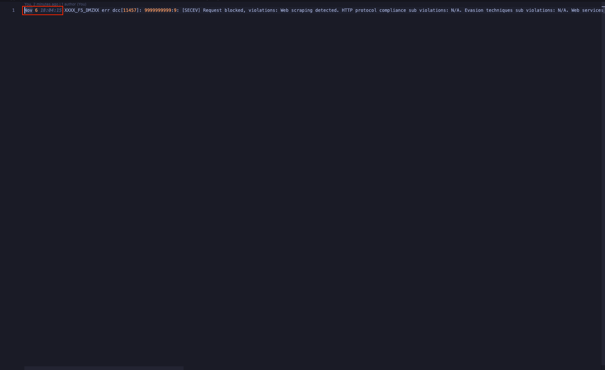
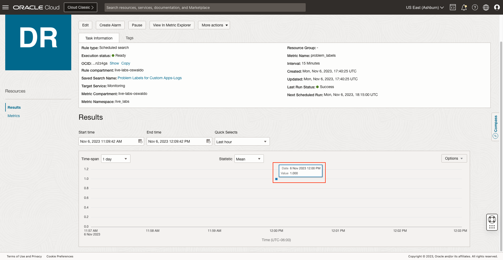
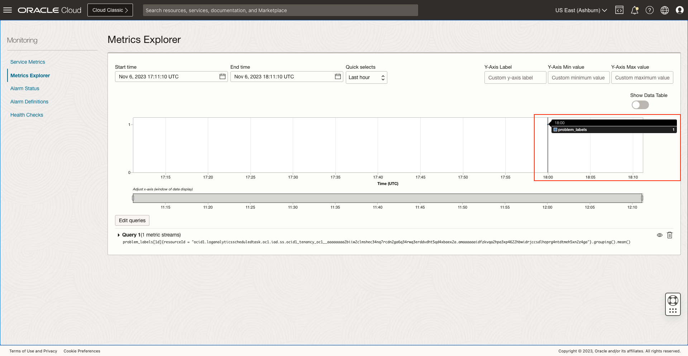

# How to create alert on critical event signatures in custom logs?

Duration: 20 minutes

## Create Parser

1. Navigate to **Parsers**.

2. Click on **Create Parser** and select **Regex Type**.

3. Click on **Advanced**.

4. Specify a **Name** and **Description (optional)**.

5. Download sample logs file for [Log Sample](./files/f5-firewall-logs.log)

6. Add the **f5-firewall-logs.log** we downloaded to **Example log content**.
   

7. Specify the following regular expression at **Parser regular expression**: **{TIMEDATE}\s+(.+)**
   

8. Select **Message** for the second field.
   

9. To verify the fields are matching with the example logs we provided, click on **Parser Test** and then on **Run Test**.

10. Click on **Create Parser**.

## Create User Defined Source

1. Navigate to **Sources**.

2. Click on **Create Source**.

3. Specify the **Name** and **Description (optional)**.

4. Select **File** as **Source Type** and **Network Firewall** at **Entity Types**.
   

5. Make sure the **Specific parser(s)** option is marked and select **F5 Firewall System Application**.
   

## Add Extended Fields

1. Click on **Extended Fields** and on **Add**.
   

2. Download example base field content file for [Log Sample](./files/example-base-field-content.log)

3. Select **Message** as **Base Field**. Set the downloaded file content for **Example Base Field Content**.

4. For **Extract Expression** set **source ip:?\s{Source IP:[0-9]{1,3}\.[0-9]{1,3}\.[0-9]{1,3}\.[0-9]{1,3}}**.
   

5. Click on **Test Definition** and see more details about test results to verify the match succeeded.

6. Click on **Add**.

## Add Labels

1. Click on **Labels** and on **Add conditional label**.
   

2. Select **Source IP** as **Input Field** and **Not In** as **Operator**. Add the following IPv4 addresses to **Condition Value**: 192.168.1.101, 192.168.1.102, 192.168.1.103
   

3. At **Select labels** select **Security Problem** label.
   

4. Click on **Add**.

5. Then click on **Create Source**.

## Upload logs file

1. Navigate to **Uploads**.

2. Click on **Upload Files**.

3. Specify an **Upload Name** and **Log Group Compartment**.

4. Select an existing **Log Group** or create a new one.

5. Download sample logs file for [Log Sample](./files/f5-firewall-logs.log)

6. Tweak the file **f5-firewall-logs.log** so the date of the log is less than 1 hour before current UTC time.
   

7. Click on **Select Files** and select the **f5-firewall-logs.log** file.
   

8. Click on **Next**.

9. Then click on **Set Properties**.

10. At **Source**, select **Problem Labels for Custom Apps-Logs** which is the source we created previously and click on **Save Changes**.
   

11. Click on **Next**.

12. Then click on **Upload**.

## Create a new Log Search

1. Navigate to **Log Explorer**.

2. For this lab, we are going to save a query using **extract** command to add a new field from an existing one. In this case, we want to add a new field derived from the **Message** to obtain the **Destination IP**.
  Type the following query in the text input: **'Log Source' = 'Problem Labels for Custom Apps-Logs' | extract field = Message 'destination ip:?\s{Destination IP:[0-9]{1,3}\.[0-9]{1,3}\.[0-9]{1,3}\.[0-9]{1,3}}' | timestats count as logrecords by 'Log Source'**
   

3. Click on **Run** and see the results below.

4. Then click on **Save as...** option inside **Actions** drop-down menu.
   

5. Select a **Saved Search Compartment**. Specify the **Search Name** and the **Search Description (optional)**.
   

6. Click on **Save** button.

## Create Scheduled search detection rule

1. Navigate to **Detection Rules**.

2. Click on **Create rule**.

3. Make sure **Scheduled search detection rule** option is selected.
   

4. Specify a **Rule name** and **Saved search compartment**.

5. Then select **Problem Labels for Custom Apps-Logs** as **Saved search** which is the one we created previously.

6. Select **Monitoring** as **Target Service**. Specify a **Metric Compartment**, **Metric Namespace** and **Metric Name**.

7. Set the **Interval** to **30 Minutes**.

8. Click on **Create detection rule**.

## Create Alarm

1. Click on **Problem Labels for Custom Apps-Logs** Scheduled search type.
   

2. Click on **Create Alarm**.
   

3. Specify an **Alarm name** and **Alarm body (optional)**. Set **Critical** for **Alarm severity**.

4. Scroll down to **Destination** and click on **Create a topic**.
   

5. Specify a **Topic name** and **Topic description (optional)**. Select **Email** as **Subscription protocol** and specify a **Subscription Email**. Click on **Create topic and subscription**.

6. Click on **Save alarm**.

## See Detection Rules and Alarms results

1. Navigate to **Detection Rules**.

2. Click on **Problem Labels for Custom Apps-Logs** which is the **Detection Rule** we created.
   

3. At **Results** we can see there has been a **Security Problem**.
   

4. Click on **View In Metric Explorer**.

5. We can see the same result in the **Metrics Explorer** view.
   

6. Click on the **Navigation menu**.
   

7. Then click on **Observability and Management**. Then, click on **Alarm Definitions** inside **Monitoring**.
   

8. Finally click on **Problem Labels for Custom Apps-Logs**.
   

9. We can see the alarm is **Firing**.

## Acknowledgements
* **Author** - Oswaldo Osuna, Logging Analytics Development Team
* **Contributors** -  Kumar Varun, Logging Analytics Product Management - Kiran Palukuri, Logging Analytics Product Management - Vikram Reddy, Logging Analytics Development Team 
* **Last Updated By/Date** - Oswaldo Osuna, Dec 4 2023
