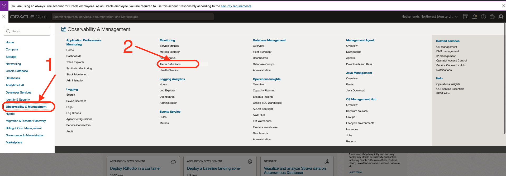

# Create & verify Detection rules alarms

## Introduction

This lab will walk you through the steps to Create & verify Detection rules alarms for Oracle Database Abnormal Termination incident.

Estimated Time: 5 minutes

### Objectives

In this lab, you will:

* Create a Basic Alarm with an Oracle predefined OOTB label.
* Verify the newly created alarm.

### Prerequisites

This lab assumes you have:

* An Oracle Cloud Infrastructure account
* An active Oracle Database Instance
* An active Detection Rule

## Task 1: Navigate to Alarm Definitions Tab

Alarms are accessed and defined in **"Observability & Management"** > **"Monitoring"** > **"Alarm Definitions"**:

1. Step 1

  Open the  **Navigation Menu**
2. Step 2

  Open **"Observability & Management"** > In **"Monitoring"** > Click **"Alarm Definitions"**.

  

## Task 2: Create an Alarm for the Detection Rule

  1. Step 1

  Click on the "Create Alarm"
  
  2. Step 2

  Fill

## Task 3: Verify Alarms

  Verify

## Learn More

* [Detect Predefined Events at Ingest Time](https://docs.oracle.com/en-us/iaas/logging-analytics/doc/detect-predefined-events-ingest-time.html#GUID-D28CF994-288F-48C3-8CE5-28CE29C3482C)

## Acknowledgements

* **Author:** Ayoub BELMEHDI, OCI Logging Analytics

* **Contributors:** Ashish GOR, Kiran PALUKURI, Vikram REDDY, Kumar Varun, OCI Logging Analytics

* **Last Updated By/Date:** Ayoub BELMEHDI, October 2023
