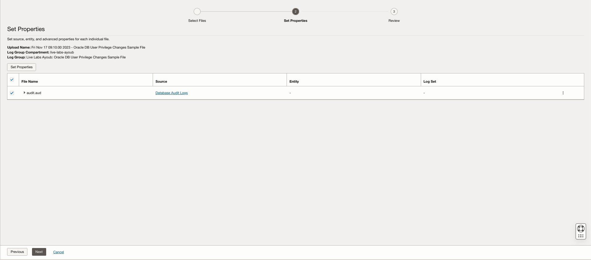

# Create Sensitive Configuration and Privilege Escalation Scheduled Detection rules alarms

## Introduction

This lab will walk you through the steps to Create & verify Scheduled Detection rules alarms to detect **Sensitive Configuration and Privilege Escalation**.
This lab explains how to create and manage single and multi-conditional labels for ingest time detection rules.

Estimated Time: 20 minutes

### Objectives

In this lab, you will:

* Create single and multi-conditional labels.
* Create an alarm for the labels

### Prerequisites

This lab assumes you have:

* An Oracle Cloud Infrastructure account

## Task 1: Check the Policies

To create and manage Detection Rules and use them in the Monitoring Service, the correct policies need to be set:

  ```Policies
    allow group &lt;group name&gt; to manage loganalytics-ingesttime-rule in tenancy
    allow service loganalytics to use metrics in tenancy
  ```

Replace the group name with whatever group fills your needs, be sure that your user is part of that group.

To set the policies go to **"Identity & Security"** > **"Identity"** > **"Policies"**


Here you can create a new policy or edit an existing one to contain the needed policies.

## Task 2: Ingest Database Audit Logs

Conditional Labels can be created via multiple ways. The most straight forward is by using the "Log Explorer". Let's ingest a log sample with the problem:

1. Step 1

  Generate the log file to upload by copying these logs into a file:

  ```Logs
    <copy>
      Thu Nov  16 14:36:23 2023 +01:00
      LENGTH : '157'
      ACTION :[67] 'ALTER PROFILE'
      DATABASE USER:[3] 'sys'
      PRIVILEGE :[6] 'SYSDBA'
      CLIENT USER:[8] 'user1'
      CLIENT TERMINAL:[0] ''
      STATUS:[1] '0'
      DBID:[9] '592398530'
    </copy>
  ```

  Edit the time from "Thu Nov  16 14:36:23 2023 +01:00" into a valid time within 3-5 upcoming minutes.
2. Step 2

  Go to **"Administration"** > **"Sources"** from the bottom left menu, look for the **"Database Audit Logs"** and select it.

  **P.S:** You can duplicate the log source, but this is not recommended because the duplicated source will not be able to get the latest Oracle Sources updates.
3. Step 3

  Click on "Upload Files", and fill the form:
  
  

  Add the file(s) with your logs, and click on "Next" when over:
  
  
4. Step 4

  In the second step, Click on "Next":
  
5. Step 5

  Check your configuration, then click on "Upload", then click on "close":
  

  You shall see your files state in the files page:
  
  

Your logs should now appear in the Logs Explorer.

## Task 3: Create the conditional Label

To create a conditional Label out of the logs ingested:

1. Step 1

  Click on "View in Log Explorer":

  
2. Step 2

  Select your Log Set (we will use "*" to search over all the logs):

  
3. Step 3

  Go to one of the logs that should raise the label, click on the 3 dots at its far right and click on "Add conditional label":

  
4. Step 4

  Fill the label's conditions fields:
  

  **Explanation:**
    1. Change "Original Log Content" to "Action"
    2. Change "equal" to "In"
    3. The condition value field should be populated with 'ALTER PROFILE', add these value one by one (These are the privileges names of database actions), hit enter after you enter each one in the field:
      - ALTER USER
      - CREATE PROFILE
      - CREATE USER
      - DROP PROFILE
      - DROP USER
5. Step 5

  Create a label in the Actions select labels field (You can use an existing label):
  
  
  
  **Explanation:**
    1. Open the label creation panel
    2. Fill the label fields
    3. Save the label
    4. Save the conditional Label

Your new label should now be ready to be used in other Monitoring services.

## Task 4: Create Detection Rule

To create a detection rule from the Label:

1. Step 1

  Go to **"Administration"** > **"Label"** > Select the Label you just created for the Conditional Label.
2. Step 2

  Click on "Ingest time detection rule" to move to the Detection Rules tab, click on "Create rule":
  
3. Step 3

  Fill the fields to create the Detection Rule:
  

  **Explanation:**
    1. Fill the name, log source, Metric Namespace & Name.
    2. Click on "Create Detection Rule".
4. Step 4

  Trigger the Detection Rule by re-uploading your logs (Follow *2. Task 2*). When done you should expect a result similar to this figure:
  

The Detection Rule should be up and ready to be used in other Monitoring services.

## Task 5: Create & Verify Alarm

To create an alarm from the Detection Rule:

1. Step 1

  Go to **"Administration"** > **"Detection"** > Select the Detection Rule you just created for the Label (you can use the breadcrumb).
2. Step 2

  Click on Create Alarm to open the alarm creation page:

  
3. Step 3

  Fill the Alarm Form:
  
  
  

  **Explanation:**
    1. Fill the name, body and severity of the alarm.
    2. Fill the metrics fields for your alarm (Choose the ones you created in the Detection Rule).
    3. Choose a topic or create and select a new one if you still have not done so.
    4. Hit the "Save alarm" button.
4. Step 4

  To verify the alarm, upload logs that triggers the "Database User Permission Change" Label, it should appear in the Log Explorer and you should receive a notification.

## Learn More

* [Detect Predefined Events at Ingest Time](https://docs.oracle.com/en-us/iaas/logging-analytics/doc/detect-predefined-events-ingest-time.html#GUID-D28CF994-288F-48C3-8CE5-28CE29C3482C)
* [Create Alarm from a Detection Rule](https://docs.oracle.com/en-us/iaas/logging-analytics/doc/create-alerts-detected-events.html)

## Acknowledgements

* **Author:** Ayoub BELMEHDI, OCI Logging Analytics

* **Contributors:** Ashish GOR, Kiran PALUKURI, Vikram REDDY, Kumar Varun, OCI Logging Analytics

* **Last Updated By/Date:** Ayoub BELMEHDI, October 2023
