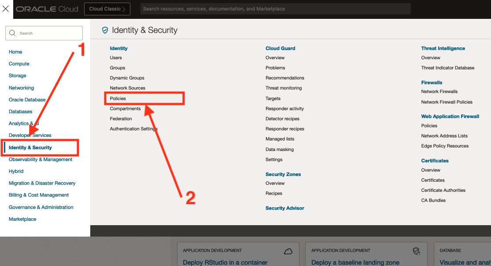

# Create Suspicious Activity and Data Exfiltration Scheduled Detection rules

## Introduction

This lab will walk you through the steps to Create & verify Scheduled Detection rules alarms to detect **Suspicious Activity and Data Exfiltration**.

This lab explains scheduled task detection rules based on numerical thresholds.

Estimated Time: 20 minutes

### Objectives

In this lab, you will:

* Create a Scheduled Detection Rule.
* Create & Verify an alarm for the Detection Rule.

### Prerequisites

This lab assumes you have:

* An Oracle Cloud Infrastructure account

## Task 1: Check the Policies

To create and manage Detection Rules and use them in the Monitoring Service, these policies need to be set:

  ```Policies
    Allow group Auditors to read audit-events in tenancy
  ```

Replace the group name with whatever group fills your needs, be sure that your user is part of that group.

To set the policies go to **"Identity & Security"** > **"Identity"** > **"Policies"**



Create a new policy or edit an existing one to contain the needed policies if you have not already.

## Task 2: Run the unsuccessful Login query and save it

The login activity records can be found in the Audit logs of your OCI tenancy (OCI Audit logs) and are accessible (Read only) from the log source with the same name. This means, they can be monitored through the "Log Explorer".

Follow these steps to monitor the failed login attempts:

1. Navigate to the logs explorer (Follow the instructions on [Lab 1: Logging Analytics Overview](?lab=la-overview#Task1:NavigatingtoLogExplorer) for more information).

2. (Optional) To see your logs in the query explorer. A log set should be set, *Jump to step 3* if you see a figure like bellow:
  

  To set the log set to '\*' and see your logs:

  

  **Explanation:**
    1. Click on the log set icon
    2. Insert '\*' in the **"Log Set"** input & hit the enter from your keyboard. A tag with '\*' will appear inside the input
    3. Click on **"apply"**

3. To query the result, Copy and Run the query bellow in the query input.

    ```MQL
    <copy>'Log Source' = 'OCI Audit Logs' and Event = interactivelogin and Status = '400' and Message = 'InteractiveLogin failed' | distinct 'Client Host City', 'User Name'</copy>
    ```

    **Explanation:**

      This query selects the **distinct regions** and **usernames** from 'OCI Audit Logs' log source's logs that have:

      * An *"InteractiveLogin"* Event
      * a status of *400* (Meaning the operation failed with Bad Request status)
      * *'InteractiveLogin failed'* Message to be sure to only catch logs where the login failed.

4. To save the search:
  
  

  **Explanation:**
    1. Click on the **"actions"** button
    2. Choose **"Save as..."**
    3. Choose a compartment
    4. Fill the **name** field for the saved search (For the rest of this live lab, we will name it "Failed Login attempts to OCI tenancy")
    5. Feel free to add a **description** to your saved search
    6. Hit the **"save"** button

Now our saved search is ready to be used to create Detection Rules.

## Task 3: Create the Scheduled Detection rule

1. To create a scheduled rule from the saved search, click on **"Actions"** and select "Create Detection Rule".

  

2. Fill the required fields then hit the save button.

  

  **Explanation:**

  Fill the Detection Rule's fields:
    1. **Rule name:** The name of your Detection Rule.
    2. **Metric Compartment:** Your metrics compartment.
    3. **Metric Namespace:** A friendly name for your metrics Namespace (We will use "" for the rest of the live lab).
    4. **Metric Name:** A friendly name for your Metric (We will use "" for the rest of the live lab).
    5. **Interval:** The interval after which the Detection Rule should be re-run, We will set it to 5 min in this live lab.
    6. Hit the "Save" button when done

  **P.S:** The metric namespace and metric name will be used to create the alarms in a later Task in this live lab.

3. To create an alarm from a scheduled Detection Rule with a new metric, an event should be triggered first, The fastest way to achieve this is by signing in to your tenancy with a wrong password.

  The results should appear in the Detection Rule's Page under the Results histogram. You can change the time range for the detection rule, the statistic and the interval.

  

  **Explanation:**

  The results showing in the histogram are logs that the Detection Rule detected, if you see no results, wait for 5 min, if you still se no results, then check your policies and review the last steps.

## Task 4: Create & verify alarms

Alarms let you generate an alert and notify the desired recipients when a predefined threshold is reached. Alarms are handled by a separate service OCI "Monitoring" service.

1. Alarms can be made via several ways. For this specific use case, the recommended way is to create it from the Detection Rule page:

  

  Click on "Create Alarm" to open the Alarm creation page.

  This will open a new tab with most of the alarm creation field already set, the remaining mandatory ones should be filled before the alarm can be saved.

  
  
  

  **Explanation:**
    1. Fill the alarm name, severity and body.
    2. Click on "Switch to Advanced Mode".
    3. Copy this query into your query code editor and replace "failed_logins" by your metric name and <your-username> by the username you want to monitor from the Detection Rule:
      ```MQL
        <copy>
          failed_logins[1m]{User_Name = "<your-username>"}.grouping().count() > 5
        </copy>```
      **P.S:** If you can not see your metrics, it is probably because still no event was detected by your rule, and you might need to trigger your rule manually before the metric shows up here. In this example, you can try to authenticate to your tenancy with wrong ids so your Detection Rule starts ingesting logs.
    4. Choose a valid statistic & interval. In this lab, we will select *count* as a statistic & *5 minutes* as the interval
    5. Set a valid interval where the state should be sustained before the alarm triggers.
    6. Select the Destination of your notification, create a new one if you do not have one already set by clicking on "Create a topic" button.

2. Because it is impractical to attempt sign in with a wrong password from multiple geographic regions, to verify the alarm, create and use a sample log file by:

  

  **Explanation:**
    1. Copy these logs in your text editor (Preferably VS Code).
      ```json
      <copy>
        {
          "data": {
            "availabilityDomain": "AD1",
            "compartmentId": "ocid1.tenancy.uniqueId",
            "compartmentName": "<your-tenancy>",
            "eventName": "InteractiveLogin",
            "identity": {
              "ipAddress": "<ip-address>",
              "principalId": "ocid1.user.oc1.uniqueId",
              "principalName": "<your-username>",
              "tenantId": "ocid1.tenancy.uniqueId",
              "userAgent": "Mozilla/5.0 (Macintosh; Intel Mac OS X 10.15; rv:109.0) Gecko/20100101 Firefox/115.0"
            },
            "message": "InteractiveLogin failed",
            "response": {
              "payload": {
                "login_input": "tenant: <your-tenancy>, user: <your-username>",
                "login_result": "PASSWORD_INVALID"
              },
              "responseTime": "2023-11-13T10:25:30.589Z",
              "status": "400"
            }
          },
          "time": "<your-time>",
          "type": "com.oraclecloud.IdentitySignOn.InteractiveLogin"
        }
      </copy>
      ```
    2. Replace these variables with your values (in your editor, Ctrl/CMD + F to change each one of this field into your values):
        - **&lt;your-tenancy&gt;:** Your actual tenancy
        - **&lt;your-username&gt;:** The username you want to monitor (In this live lab, We will monitor "livelabsuser")
        - **&lt;your-time&gt;:** A valid time in the next 2-5 minutes. This will serve to trigger the detection rule (In the UTC format).
        - **&lt;ip-address&gt;** The Ip address of the sign in attempt. This field will be used to detect the geographic location, be sure to generate ip addresses from different locations (from an online tool for example) or use these sample:
        ```text
          22.60.240.244
          196.220.230.205
          40.39.48.34
          217.128.212.236
          17.241.30.58
        ```
    3. Duplicate this sample log enough times to trigger the alarm (in this tutorial the alarm is triggered after 5 times, meaning we will duplicate our logs 5 times in the file), Pay attention to the date and the Ip address.
    4. Edit the time field to a valid datetime in the upcoming 3-5 minutes.

2. Duplicate your final logs another time and increment the time in the newly duplicated logs by 1 minute.

3. By now, you should have a file with logs triggering the alarm.

  When the logs ready, Upload them into your "OCI Audit Logs" source:
    1. Go back to **"Administration"** > **"Sources"**.
    2. Look for "OCI Audit Logs" and select it.
    3. Click on "Upload Files".
    4. Fill the fields:
      - **Upload Name:** Fill a name for the Upload (Will be handy if you need to edit the logs).
      - **Log Group Compartment:** Choose the compartment where you want your logs to be stored.
      - **Log Group:** Pick a log group or create a new one then pick it here.
    5. Select the file(s) you want to upload. Click on Next.
    6. Click on Next a second time.
    7. Check the information on the screen and click on the "Upload" button when done.
    8. Click on "Close" and wait a little while for the file to be processed then for its logs to show of in the services (Log Explorer, Detection Rule, etc...).

  When the logs are ready, your alarm should be triggered and you should receive a notification in your topic.

You may now **proceed to the next lab**.

## Learn More

* [OCI Audit Logs](https://docs.oracle.com/en-us/iaas/Content/Audit/Concepts/auditoverview.htm)
* [Scheduled Saved Search](https://docs.oracle.com/en-us/iaas/logging-analytics/doc/create-schedule-run-saved-search.html#GUID-A37A3F93-BE74-4850-859D-C8D293781036)
* [Query Search](https://docs.oracle.com/en-us/iaas/logging-analytics/doc/query-search.html)
* [Query Metric Landing](https://docs.oracle.com/en-us/iaas/Content/Monitoring/Tasks/query-metric-landing.htm#top)

## Acknowledgements

* **Author:** Ayoub BELMEHDI, OCI Logging Analytics

* **Contributors:** Ashish GOR, Kiran PALUKURI, Vikram REDDY, Kumar VARUN, Jolly KUNDU, OCI Logging Analytics

* **Last Updated By/Date:** Ayoub BELMEHDI, October 2023
