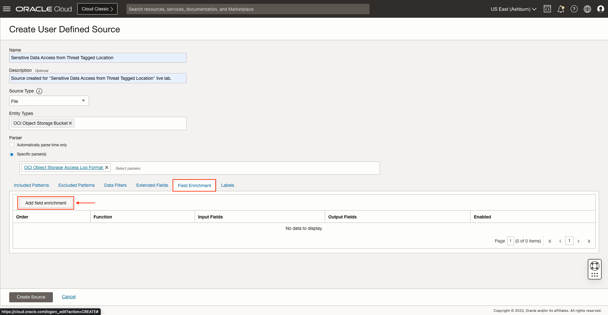
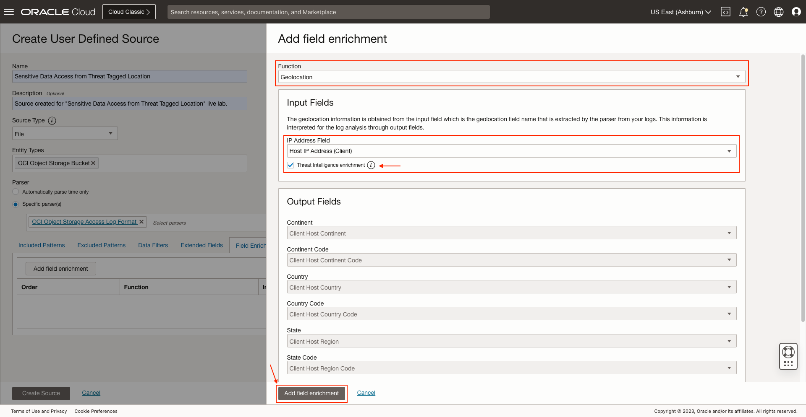
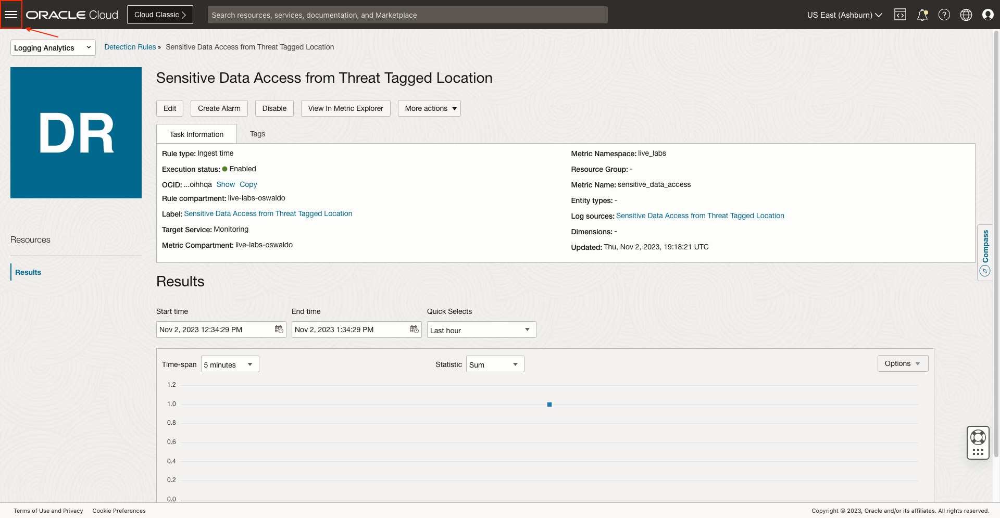

# How to create alert for sensitive data access from suspicious IPs?

Duration: 5 minutes

## Create Source and add field enrichment

1. Navigate to **Sources**.

2. Click on **Create Source**.

3. Specify the **Name** and **Description (optional)**. Select **File** as **Source Type** and **OCI Object Storage Bucket** at **Entity Types**.

4. Make sure the **Specific parser(s)** option is marked and select **OCI Object Storage Access Log Format**.
   

5. Click on **Field Enrichment** and on **Add field enrichment**.
   

6. Select **Geolocation** in **Function**.

7. Then select **Host IP Address (Client)** in **IP Address Field** and mark **Threat Intelligence enrichment**.

8. Click on **Add field enrichment**.
   

9. Finally click on **Create Source**.
   

## Create Ingest time detection rule

1. Navigate to **Detection Rules**.

2. Click on **Create rule**.

3. Click on **Ingest time detection rule**.

4. Specify the **Rule name**. Select **Sensitive Data Access from Threat Tagged Location** for **Label** and **Sensitive Data Access from Threat Tagged Location** for **Filter by log source**.
   

5. Select **Monitoring** for **Target Service**. Specify a **Metric Compartment**, **Metric Namespace** and **Metric Name**.
   

6. Click on **Create detection rule**.

## Create alarm

1. Click on **Sensitive Data Access from Threat Tagged Location** which is the **Detection Rule** we created.
   

2. Click on **Create Alarm**.

3. Specify an **Alarm name** and **Alarm body (optional)**. Set **Critical** for **Alarm severity**.

4. Scroll down to **Destination** and click on **Create a topic**.
   

5. Specify a **Topic name** and **Topic description (optional)**. Select **Email** as **Subscription protocol** and specify a **Subscription Email**.

6. Then click on **Create topic and subscription**.

7. Click on **Save alarm**.

## Upload logs file

1. Navigate to **Uploads**.

2. Click on **Upload Files**.

3. Specify an **Upload Name** and **Log Group Compartment**.

4. Select a **Log Group** or create a new one.

5. If you decided to create a **Log Group** specify a **Name** and **Description (optional)** and click on **Create**.

6. Download sample logs file for [Log Sample](./files/threat-tagged-location-logs.log)

7. Tweak the logs' date so it is less than 1 hour before current UTC time.
   

8. Click on **Select Files** and select the **threat-tagged-location-logs.log** file.
   

9. Click on **Next**.

10. Then click on **Set Properties**.

11. At **Source**, select **Copy of OCI Object Storage Access Logs** which is the source we created previously and click on **Save Changes**.
   

12. Click on **Next**.

13. Then click on **Upload**.

14. When the **Submission Status** is **Success**, click on **Close**.

## See Detection Rules and Alarms results

1. Navigate to **Detection Rules**.

2. Click on **Sensitive Data Access from Threat Tagged Location** which is the **Detection Rule** we created.
   

3. At **Results** we can see there has been a **Sensitive Data Access from Threat Tagged Location**.
   

4. Click on **View In Metric Explorer**.

5. We can see the same result in the **Metrics Explorer** view.
   

6. Click on the **Navigation menu**.
   

7. Click on **Observability and Management** and then click on **Alarm Definitions** inside **Monitoring**.
   

8. Click on **Sensitive Data Access from Threat Tagged Location**.
   

9. We can see the alarm is **Firing**.

## Acknowledgements
* **Author** - Oswaldo Osuna, Logging Analytics Development Team
* **Contributors** -  Kumar Varun, Logging Analytics Product Management - Kiran Palukuri, Logging Analytics Product Management - Vikram Reddy, Logging Analytics Development Team 
* **Last Updated By/Date** - Oswaldo Osuna, Dec 4 2023
