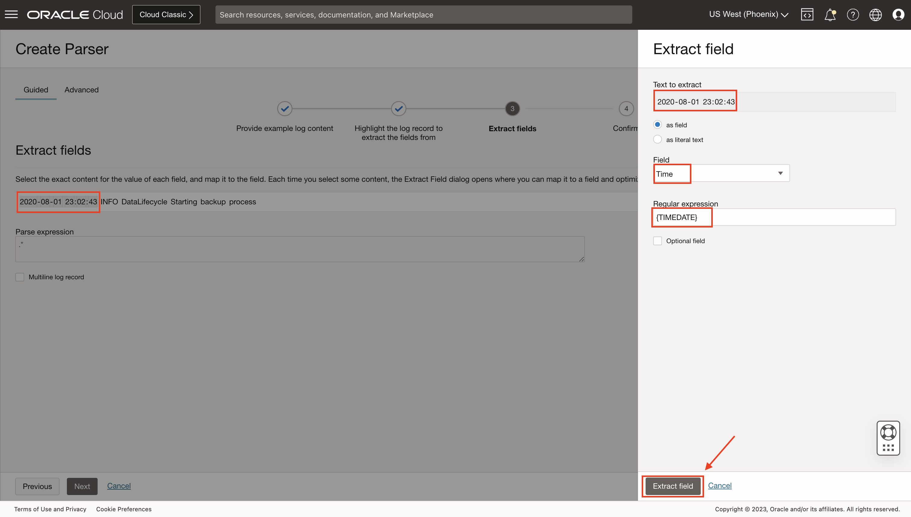
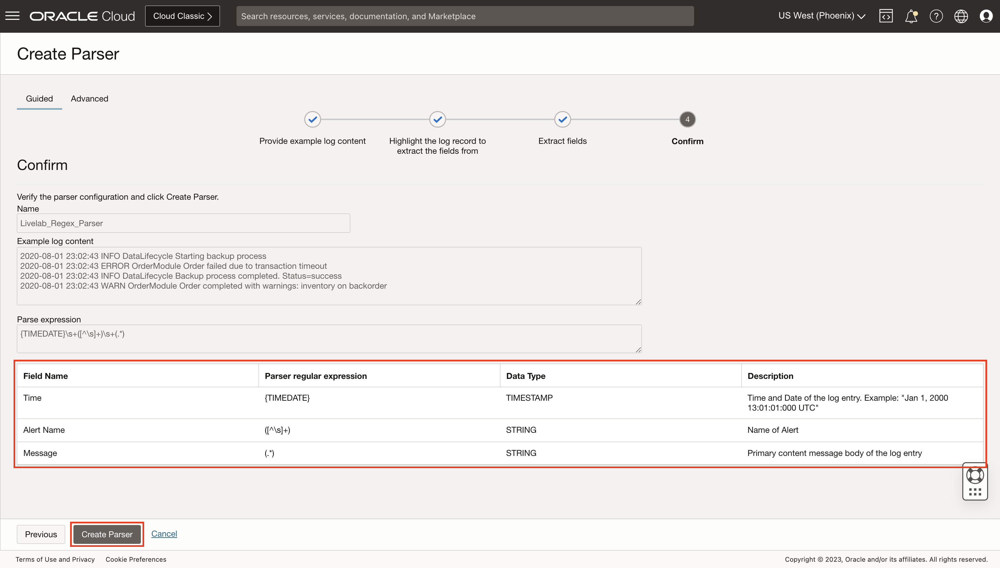

# Unsuccessful Food Orders

## Introduction

In this lab, you will understand the concept of Parsers in Logging Analytics.

Estimated Time: 30 minutes.

### Objectives

In this lab you will:

* Understand the meaning of Parsers.
* Create a single-line parser.
* Create a multi-line parser.
* Visualize parsed data in explorer.
* Create alarms for more than 30% unsuccessful orders in 15 mins

## Task 1: Understand Parsers

A Parser takes raw configuration data and parses it into a nested attribute structure. Each parser consists of a base parser and parser parameters. Some parsers also contain post-parsing rules. A base parser essentially is a category of parser capable of parsing data of a particular format. Parser parameters provide a way to tailor the base format to accommodate variations in data formatting.

Oracle Logging Analytics offers hundreds of Oracle-defined sources and parsers that you can directly use without creating custom ones. To collect logs of a format which doesn't have an Oracle-defined source or parser, you can create custom source or parser.

There are four varieties of base parser:

1. Regex
2. JSON
3. XML
4. Delimited

## Task 2:  Create single-line parser

In this task you will learn how to create a Regex single-line parser.

1. From **Navigation Menu**  > **Observability & Management** > **Logging Analytics** > **Administration** > **Parsers box** > **Create Parser**.


2. Create Parser page opens. Click on **Create Parser**. Dropdown list of four types of parser will appear. Click on **Regex type** to create a Regex Parser.


3. The **Create Parser page** is displayed. In case of Regex Type, the Create Parser page opens in the **Guided mode**, by default. Continue in this mode if you want Logging Analytics to generate the regular expression to parse the logs after you select the fields. If you want to write regular expression for parsing, then switch to **Advanced mode.**

- In the **Name** field, enter the parser name. For example, enter **Livelab\_Regex\_Parser**.
- (Optionally) You can provide a suitable **description** to the parser for easy identification.
- In the **Example Log Content field**, you can upload a log file or paste the contents from a log file that you want to parse,  such as the following:

```
2020-08-01 23:02:43 INFO DataLifecycle Starting backup process
2020-08-01 23:02:43 ERROR OrderModule Order failed due to transaction timeout
2020-08-01 23:02:43 INFO DataLifecycle Backup process completed. Status=success
2020-08-01 23:02:43 WARN OrderModule Order completed with warnings: inventory on backorder
```

- Select the **Treat entire file as a single log entry check box**, if required. This option lets you parse and store an entire log file as a single log entry. We will not select this as we have multiple log lines.
- If the log entry has a lot of text that you want searchable, then you might want to consider selecting the check box **Enable raw-text searching on this content.** This option enables you to search the log records with the Raw Text field. When enabled, you can view the original log content with the raw text.
- Click on **Next**.


4. Click on any **one log record** to extract the fields that you want to parse. Click on **Next**.


5. 



6. 




## Task 3:  Create multi-line parser

qwertyuiop

## Task 4: Visualize parsed data in explorer

qwertyuiop

## Task 5: Create alarms for more than 30% unsuccessful orders in 15 mins

qwertyuiop

You may now proceed to the [next lab](#next).

## Learn More

qwertyuiop

## Acknowledgements

* **Author** - Chintan Kalsaria, OCI Logging Analytics
* **Contributors** -  Chintan Kalsaria, OCI Logging Analytics
* **Last Updated By/Date** - Chintan Kalsaria, Oct, 2023
