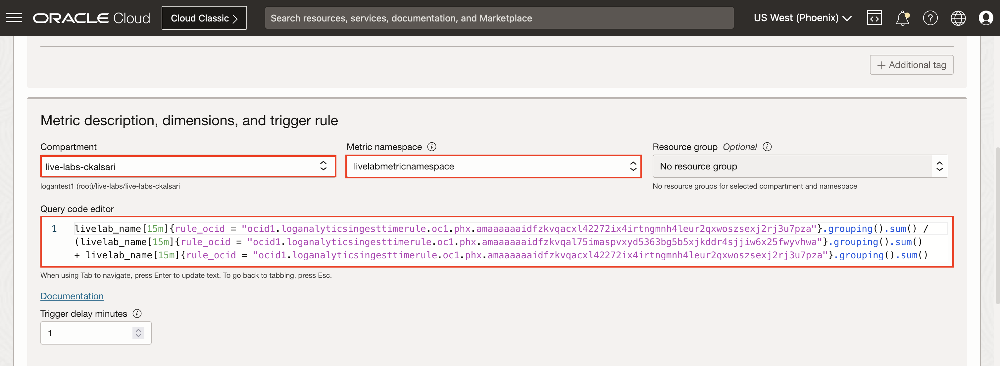
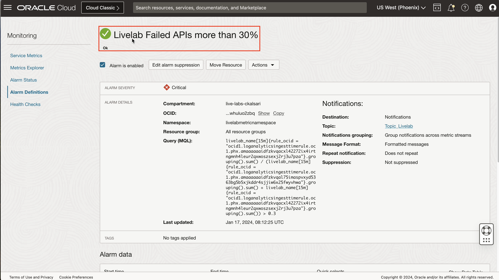
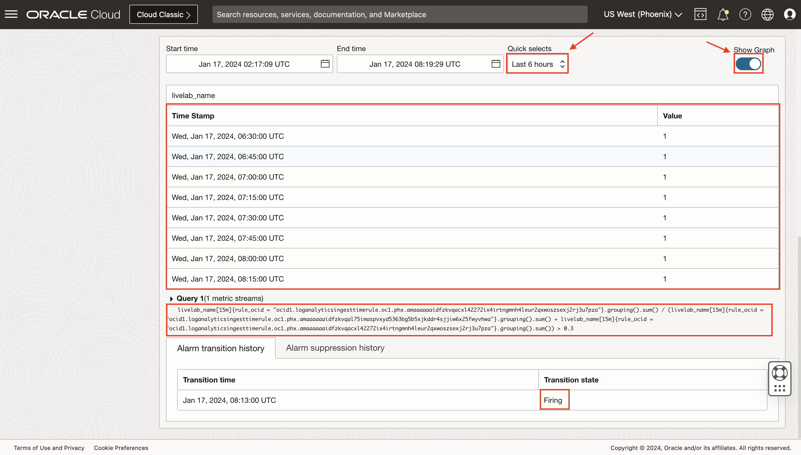

# Unsuccessful Food Orders

## Introduction

In this lab, you will understand the concept of Parsers in Logging Analytics.

Estimated Time: 30 minutes.

### Objectives

In this lab you will:

* Understand the meaning of Parsers.
* Create a single-line parser.
* Create a multi-line parser.
* Visualize parsed data in explorer.
* Create alarms for more than 30% unsuccessful orders in 15 mins

### Prerequisites

This lab assumes you have:

* An Oracle Cloud Infrastructure account.

## Task 1: Understand Parsers

A Parser takes raw configuration data and parses it into a nested attribute structure. Each parser consists of a base parser and parser parameters. Some parsers also contain post-parsing rules. A base parser essentially is a category of parser capable of parsing data of a particular format. Parser parameters provide a way to tailor the base format to accommodate variations in data formatting.

Oracle Logging Analytics offers hundreds of Oracle-defined sources and parsers that you can directly use without creating custom ones. To collect logs of a format which doesn't have an Oracle-defined source or parser, you can create custom source or parser.

There are four varieties of base parser:

1. Regex
2. JSON
3. XML
4. Delimited

## Task 2:  Create single-line parser

In this task you will learn how to create a single-line parser.

For creating a single-line parser, we need a sample log record(s), which we wanted to parse. By creating a parser, you define how to extract log entries from a log file and also how to extract fields from a log entry. Click on **Create Parser** button.

1. You can navigate to **Parser page** as mentioned in [Lab 7: Task 1](?lab=dns-exfiltration#Task1:NavigatetoParsers). Click on **Create Parser** button.

2. A dropdown will appear, showing four types of parsers available. As per our type of sample log you can select any. In this lab you will create a **Regex Type** parser. Click on **Regex Type**.


3. The **Create Parsers Page** page is displayed. In case of Regex Type, the Create Parser page opens in the **Guided** mode, by default. Continue in this mode if you want Logging Analytics to generate the regular expression to parse the logs after you select the fields. If you want to write regular expression for parsing, then switch to **Advanced** mode. You will go for **Guided** mode, as it is very easy method to create Parser, you don't need knowledge of regular expression.

4. This is the first step of parser creation.

    * In the **Name** field, enter the parser name. For example, enter **livelab\_mushop\_api\_logs**.
    * (Optional) Provide a suitable **description** to the parser for easy identification.
    * In the **Example Log Content field**, paste the contents from a log file that you want to parse, such as the following:
        ```
        <copy>::ffff:10.244.1.225 - livelab_user [06/Nov/2023:03:22:17 +0000] "POST /api/orders HTTP/1.1" 401 70 "-" "python-requests/2.25.1"
        ::ffff:10.244.1.42 - livelab_user [06/Nov/2023:21:00:35 +0000] "POST /api/orders HTTP/1.1" 503 86 "-" "python-requests/2.25.1"
        ::ffff:10.244.1.42 - livelab_user [06/Nov/2023:08:25:16 +0000] "POST /api/orders HTTP/1.1" 500 120 "-" "python-requests/2.25.1"
        ::ffff:10.244.0.104 - livelab_user [06/Nov/2023:02:51:18 +0000] "GET /api/orders HTTP/1.1" 200 719 "-" "python-requests/2.25.1"</copy>
        ```
    * This is a single-line log entry, as each record is of single line, as shown in the figure below.
        

    * Click on **Next** to go to second step of parser creation.

5. Select one of the log records, you want to extract the field from.
    
    Click on **Next** to go to third step of parser creation.

6. Select the exact content for the value of each field. For example select the **::ffff:10.244.0.14"** content from the shown log record, a dialog of **Extract field** will appear. Here you can see the text you want to extract as a field, there is option if you don't want to extract it as field, you can select the **as literal text** option. From the Field dropdown, select the existing **Field Name**, here it is **Host IP Address (Client)**. You can also create a custom field, if it is not present in the dropdown. The **Regular expression** for the selected text will be auto generated. Mark the **Optional field** button if you want to make the field as optional. Click on **Extract field** option to map the selected text to field.
    

7. Selected text has been mapped to the field, you can see the **Parser Test**, where **Host IP Address (Client)** has been extracted out of all the log records which were pasted in Step 4. **Parser expression** will also be auto generated. **Match Status** will show if we are successful in extracting the field from all the log records. Click on **Next** to select another content to log record to be extracted out.
    

8. Repeat the Step 7, by selecting other content of log i.e. **livelabuser01**. After clicking on **Next**, you will see other column of **User Name** field has been added to the table showing extracted user names from the log records. You will also see the **Parse expression** has been modified now.
    

9. Similarly, repeat the Step 7, until you extracted all the field from selected log record, you will see all the extracted field in the table, with its extracted value from the log records. Verify by observing all the extracted fields, if they seems fine. Click on **Next**.
    

10. This is the last step of parser creation. Verify the **Parser expression**, field name, parser regular expression, data type, description of each field and other fields. If you want to change something, you can go to **Previous** step, or else click on **Create Parser** to create parser.
    

## Task 3: Visualize parsed data in explorer

In this task, you will learn, how to visualize the parsed data in explorer. You will use the same logs that were used in **Task 2**.

For, viewing the logs in log explorer, you will need a log source, which will be mapped with the parser you have made in **Task 2**. Sources define the location of your entity's logs and how to enrich the log entries. To start continuous log collection through the OCI management agents, a source needs to be associated with one or more entities.

1. You can navigate to **Sources page** as mentioned in [Lab 7: Task 3](?lab=dns-exfiltration#Task3:NavigatetoSources). Click on **Create Source** button.

2. A **Create User Defined Source** page will appear. Fill the details:
    * **Name:** Enter the name of the source for example, **Livelab API Mushop Log Source**.
    * (Optional)**Description:** Add a short description to describe the source.
    * **Source Type:**  Oracle Log Analytics supports six log source types:
        * File, Oracle Diagnostic Logging (ODL), Syslog Listener, Database, REST API, Microsoft Windows.
        * **File** is use for collecting most types of logs, such as Database, Application, and Infrastructure logs, you will use this.
    * **Entity Type:** Click the Entity Type field and select the type of entity for this log source. Later, when you associate this source to an entity to enable log collection through the management agent, only entities of this type will be available for association. A source can have one or more entity types. Here entity types does not matter as you will be uploading the log file directly from the desktop as seen in **Task: 2**.
    * **Parser:** You have made a parser in **Task: 2**, select **Specific parser(s)** button and select the user defined parser which was created earlier i.e. **livelab\_mushop\_api\_logs**.
    * Rest all the fields are Optional and not required in this Lab.
    * Click on **Create Source**.
    

4. Source **Livelab API Mushop Log Source** is created with parser **livelab\_mushop\_api\_logs**. Now, you need to get logs in from this log source. There are various ways to ingest logs in source as discussed in [Lab 1: Task 3](?lab=la-overview#(ReadingExerciseOnly)Task3:NavigatingtotheAddDataPage).

5. Copy the log records provided in **Task 2**, paste it in a text file and save it in your local computer with .txt extension.

6. Refer to [Lab 1: Task 6](?lab=la-overview#(ReadingExerciseOnly)Task6:Uploadlogfilesfromyourcomputerdesktop) for uploading the locally saved log file to the log source. While uploading:
    * Select existing **Log Group** in your compartment, if you don't have any, you can create it easily by clicking on **Create Log Source**.
    * Make sure to select the Log Source as **Livelab API Mushop Log Source**, which was created in Step 3.

7. Last step, is to click on **View In Log Explorer**, on the page which comes in the last step of [Lab 1: Task 6](?lab=la-overview#(ReadingExerciseOnly)Task6:Uploadlogfilesfromyourcomputerdesktop).

8. Log explorer will appear, showing all four parsed logs. To have more understanding about Log Explorer, you can refer to [Lab 1: Task 2](?lab=la-overview#Task2:UserinterfacesofLogExplorer).
    

9. Click on the **Arrow** circled in the above image, to view all the fields extracted out from log record by parser.
    

## Task 4: Create alarms for more than 30% failed APIs in 15 mins

In this task, you will create an alarm for real life based application. The API logs which we are using will be classified into **Livelab Passed API** and **Livelab Failed API**. In each 15 minutes interval if there are more than 30% of Livelab Failed APIs, an alarm will be triggered.

You will be creating two detection rules, one in which you will classify and label log record as **Livelab Passed API** and other to classify and label log record as **Livelab Failed API**, using these two labels, you will create an alarm.

1. You can navigate to **Sources page** as mentioned in [Lab 7: Task 3](?lab=dns-exfiltration#Task3:NavigatetoSources). Search for **Livelab API Mushop Log Source**, which was created in **Task 3**. Click on it.

2. Click on **Edit** button.
    

3. Click on **Labels**, to add label. Cick on **Add conditional label**.
    

4. You will create label for Failed API. In the Conditions section:
    * Select the log field on which you want to apply the condition from the Input Field list. Select **Status** from dropdown list.
    * Select the operator from the Operator list. Select **Contains** or **Equals**. Both can be used in the given usecase.
    * In the Condition Value field, specify the value of the condition to be matched for applying the label. For failed APIs, values of Status can be **401, 400, 404, 406, 408** which we extracted using parsers from log records.
    * Under Actions, select from the already available Oracle-defined or user created labels. If required, you can create a new label by clicking **Create Label**.
    

5. **Create Label** dialog box will appear. Fill in the details:
    * **Label Name:** Enter the label name. For example, **Livelab Failed API**.
    * (Optional) **Description:**  Enter the details about the label.
    * Labels can be marked as being a problem with a priority to make those log entries more prominent in the Log Explorer. To assign priority to the label. Under Livelab Failed API select **Yes** check box.
    * In the Problem Priority field, click the down arrow and select a priority. For example, select **Medium**.
    * A log entry will be assigned a problem priority based on the labels that get attached to the log entry. In this case, if Livelab Failed API has a problem priority of Medium, any log entry that matches a condition such that it gets the Livelab Failed API label would have a problem priority of Medium.
    * In the **Related Terms** field, enter the terms that are related to the log entry.
    * Click on **Create**.


6. Similarly, add another label, named **Livelab API Passed**. Uncheck the **Use this label to indicate a problem**, as are not having any problem for passed APIs. For adding condition:
    * If the **Status** does not contain or not equal to **401, 400, 404, 406, 408**, the log record can be labelled as passed.
    * Select **Status** from dropdown list in Input Field List. Select **Not Contain** operator. Add **401** as condition value.
    * **Not Contain** operator only allows for one value, so add more conditions by clicking on the Add Condition icon, marked as 2 in below image.
    * Select the logical operation to apply on the multiple conditions. Select **AND**.
    * Similarly add other 4 conditions where Status does not contain **406,409,400,404**.
    * Click on **Add**.


7. In the **Edit Source**, you will be able to see the two condition with its associated label. Click on **Save Changes**.
    

8. Create two ingest time detection rules, as discussed in [Lab 2: Task 4](?lab=alarms-detection-rules#Task4:CreateDetectionRules)

9. One rule for detecting **Livelab API Passed** label. Fields to be filled in Create detection rule page:
    * **Rule name:** Livelab Detect Passed API.
    * **Metric Namespace:** livelabmetricnamespace.
    * **Metric Name:** livelab_name.
    
     * Click on **Create detection rule**.

10. Other rule for detecting **Livelab Detect Failed API**. Fields to be filled in Create detection rule page:
    * **Rule name:** Livelab Detect Failed API.
    * **Metric Namespace:** livelabmetricnamespace.
    * **Metric Name:** livelab_name.

     * Click on **Create detection rule**.

11. Make sure that Metric Namespace and Metric Name remains same throughout the task, or else results may not appear.

12. Navigate to **Create Alarm page** as discussed in Option 1 of [Lab 2: Task 5](?lab=alarms-detection-rules#Task5:CreateAlarmsandNotifications)

13. Provide alarm name as **Livelab Failed APIs more than 30%**. Click on **Switch to Advanced Mode**, as a complex query will be required which will be using two labels from detection rule to create this alarm.
    

14. Make sure that the compartment and Metric Name is same as given for detection rules. Inside query editor, paste this query:
    ```
    <copy>livelab_name[15m]{label = "Livelab API Failed"}.grouping().sum() / (livelab_name[15m]{label = "Livelab API Passed"}.grouping().sum() + livelab_name[15m]{label = "Livelab API Failed"}.grouping().sum()) > 0.3</copy>
    ```
    This query  is the condition, when the alarm will trigger. Query implies, if the total no of log records with failed labels divide by total no of log records (failed labels and passed labels) is greater than 0.3 i.e. more than 30%, then the alarm will trigger.

    

    Currently, there is not data uploaded after creating alarm, so you see the graph is empty. You can have a table view by clicking on **Show Data Table**.

15. Now, **Define alarm notification**, select the **Destination service**, **compartment** and **Topic**, if there are no existing topic, you can create a new one just by clicking on **Create a topic**. For more information regarding these options, you can refer [Lab 2: Task 5](?lab=alarms-detection-rules#Task5:CreateAlarmsandNotifications)
    

16. Click on **Save alarm**. **Alarm Definitions page** will show up, providing the details of alarm, with a **Ok** mark.
    

17. Now, your alarm is ready. To test it, you will have to give some log records.

18. A **python script** is attached with this lab. Download it, run it. A file named **logrecords\_for\_livelab.txt** will be created at the location, where this script is executed. These file will contains 1000 random log records, generated in interval of your current UTC time and 2 hours before your current UTC time.

    >**NOTE :** Alarm only works if the logs are not more than 2 hours older.

19. Refer to **Step 7 of Task:3**, for uploading the local file to console. Once the file is uploaded and processed, you will see **Processing Status** as Successful, as shown in below image.
    

20. As the file is processed, the log records will also be parsed with the provided parser. All logs will be labelled as **Livelab Failed API** or **Livelab Passed API**. The alarm will check all the logs in interval of 15mins, runs it query, and will be triggered as soon as the queries satisfies.

21. Open **Navigation Menu**  > **Observability & Management** > **Monitoring** > **Alarm Definitions** > **Livelab Failed APIs more than 30%** alarm. You will notice, the alarm has changed its state from **Ok** to **Firing**. A graph can be seen under **Alarm data** as shown in image. Click on **Show Data Table**
    

22. From data table, you can clearly observe, the alarm has been triggered 5 times, in interval of 15 minutes, in last hour. Click on **Quick selects** dropdown, and change time to **Last 6 hours**. By observing the table, it can be observed that for the uploaded logs, the alarm triggered 9 times, and sent a notification to selected destination.
    

    You can also observe, that the alarm was initially in **Ok** state, then it went to **Firing** state, after some time, it will go to **Reset** state, waiting to go to **Firing** state again.

You may now **proceed to the next lab**.

## Learn More

For further reading please refer to the resources.

[Create a Parser] (<https://docs.oracle.com/en-us/iaas/logging-analytics/doc/create-parser.html>)

[How to use a RegEx Parser Builder?] (<https://www.youtube.com/watch?v=EoBJkaq9Png>)

[Create a Source] (<https://docs.oracle.com/en-us/iaas/logging-analytics/doc/create-log-source.html>)

[Upload Logs on Demand] (<https://docs.oracle.com/en-us/iaas/logging-analytics/doc/upload-logs-demand.html>)

[Managing Alarms] (<https://docs.oracle.com/en-us/iaas/Content/Monitoring/Tasks/managingalarms.htm>)

## Acknowledgements

* **Author** - Chintan Kalsaria, OCI Logging Analytics
* **Contributors** -  Chintan Kalsaria, Kiran Palukuri, Ashish Gor, Kumar Varun, OCI Logging Analytics
* **Last Updated By/Date** - Chintan Kalsaria, Dec, 2023